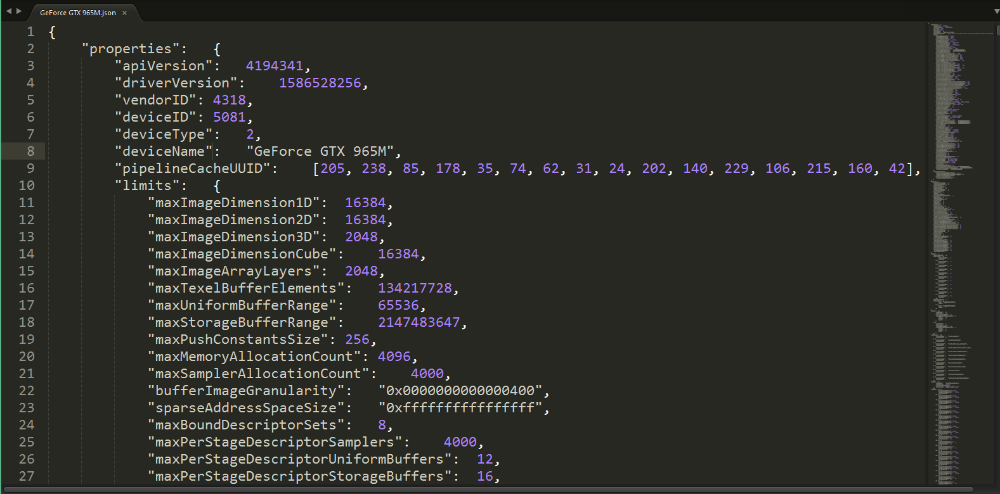

#Vulkan Tutorial 01 开发环境搭建之Windows

相信很多人在开始学习Vulkan开发的起始阶段都会在开发环境的配置上下一些功夫，
那么本问将会引导大家快速的完成Vulkan在Windows下的开发环境，并使用几个常用的开发工具库。

## Vulkan SDK
开发Vulkan应用程序所需的最重要的组件就是SDK。它包括核心头文件、标准的Validation layers及调试工具集、和驱动Loader，
如果现在这些关键词不是很明白的话，不要紧，我会在后续的教程上向大家说明。

首先下载SDK,登录LunarG网站 the LunarG website ，选择Windows平台下的最新SDK下载安装，特别留意的是这个SDK包括了很多的内容，
诸如Samples、Documents，这些资料非常有助于学习。

继续安装并注意SDK安装的位置，安装完成后我们首先验证您的PC 显卡驱动程序是否支持Vulkan，
进入安装SDK的目录,打开Bin32目录运行cube.exe演示程序，您将会看到以下内容。

如果您收到了异常信息，请确保您的显卡驱动程序是最新的，且硬件驱动支持Vulkan运行时，具体细节可以到各显卡厂商官网确认。

此目录中还有另外两个程序对开发有价值，vkjson_info.exe程序生成一个JSON文件，并在使用Vulkan根据具体的硬件参数有选择性的开启功能。
 
 

当然这里也有一个地址，可以查看显卡对VulkanSDK api版本的不同支持情况。http://vulkan.gpuinfo.org/

glslangValidator.exe程序将用于将着色器从可读的GLSL编译为字节码。我们将在着色器模块一章中深入介绍这一点。 
Bin32目录还包含Vulkan加载程序和验证层的二进制文件，而Lib32目录包含库。 
Doc目录包含有关Vulkan SDK的有用信息以及整个Vulkan规范的脱机版本。最后，包含Vulkan头文件的Include目录。

## GLFW

Vulkan不包含用于创建窗口来渲染内容的工具，出于跨平台的考虑，Sample中使用了SDL来作为窗口系统的实现方案，
本教程将使用GLFW库创建一个支持Windows的窗口，他的优势在于将Vulkan中的其他一些平台订制的内容抽象出来。

可以在GLFW官方下载最新的版本 ,在本教程中我们将使用32位库
下载后将头文件目录GLFW，静态库glfw3.lib、glfw3dll.lib、动态库glfw3.dll 分别放到VulkanSDK安装目录下的Third-Party的对应目录里。

## GLM

Vulkan不包括用于数学计算的实用工具库,因此我们引入GLM库 ，该库专为图形API为设计，并且大量应用与OpenGL程序。
注，VulkanSDK中目前已经包含GLM在Third-Part | Include 目录中。
GLM仅包含一个头文件，所以只需要下载最新版本，同上文GLFW一样放置到VulkanSDK | Third-Part |Include 目录下即可。

## Setting up Visual Studio
从Vulkan模版中新建测试程序，注意在新项目创建完成后，Vulkan VS模版会自动创建一个基于SDL窗口的程序，
在此可删除掉 或替换为下文的测试代码。
新建测试C++文件，并添加如下测试代码。

<pre>
#define GLFW_INCLUDE_VULKAN
#include <GLFW/glfw3.h>
#define GLM_FORCE_RADIANS
#define GLM_FORCE_DEPTH_ZERO_TO_ONE
#include <glm/vec4.hpp>
#include <glm/mat4x4.hpp>
#include <iostream>

int main() {
    glfwInit();

    glfwWindowHint(GLFW_CLIENT_API, GLFW_NO_API);
    GLFWwindow* window = glfwCreateWindow(800, 600, "Vulkan window", nullptr, nullptr);

    uint32_t extensionCount = 0;
    vkEnumerateInstanceExtensionProperties(nullptr, &extensionCount, nullptr);

    std::cout << extensionCount << " extensions supported" << std::endl;

    glm::mat4 matrix;
    glm::vec4 vec;
    auto test = matrix * vec;

    while (!glfwWindowShouldClose(window)) {
        glfwPollEvents();
    }

    glfwDestroyWindow(window);

    glfwTerminate();

    return 0;
}
</pre>

会遇到编译错误GLFW，现在添加具体的库引用如图。

再次运行程序，恭喜你可以看到第一个Vulkan程序运行起来了。

[代码](src/01.cpp)。

