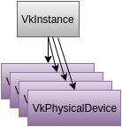

# Vulkan Tutorial 05 物理设备与队列簇

## Selecting a physical device

通过VkInstance初始化Vulkan后，我们需要在系统中查找并选择一个支持我们所需功能的显卡。
实际上，我们可以选择任意数量的显卡并同时使用他们，但在本小节中，我们简单的设定选择规则，
即将查找到的第一个图形卡作为我们适合的物理设备。

 
 
我们添加函数pickPhysicalDevice并在initVulkan函数中调用。

<pre>
void initVulkan() {
    createInstance();
    setupDebugCallback();
    pickPhysicalDevice();
}

void pickPhysicalDevice() {

}
</pre>

最终我们选择的图形显卡存储在类成员VkPhysicalDevice句柄中。当VkInstance销毁时，这个对象将会被隐式销毁，
所以我们并不需要在cleanup函数中做任何操作。

VkPhysicalDevice physicalDevice = VK_NULL_HANDLE;
关于获取图形卡列表的方式与获得扩展列表的方式类似。

uint32_t deviceCount = 0;
vkEnumeratePhysicalDevices(instance, &deviceCount, nullptr);
如果Vulkan支持的设备数为0，那么没有任何意义进行下一步，我们选择抛出异常。

if (deviceCount == 0) {
    throw std::runtime_error("failed to find GPUs with Vulkan support!");
}
否则我们分配数组存储所有VkPhysicalDevice的句柄。

std::vector<VkPhysicalDevice> devices(deviceCount);
vkEnumeratePhysicalDevices(instance, &deviceCount, devices.data());
现在我们需要对它们进行评估，检查它们是否适合我们要执行的操作，因为并不是所有的显卡功能一致。为此我们添加一个新的函数:

bool isDeviceSuitable(VkPhysicalDevice device) {
    return true;
}
我们将检查是否有任何物理设备符合我们的功能需求。

<pre>
for (const auto& device : devices) {
    if (isDeviceSuitable(device)) {
        physicalDevice = device;
        break;
    }
}

if (physicalDevice == VK_NULL_HANDLE) {
    throw std::runtime_error("failed to find a suitable GPU!");
}
</pre>

下一节我们介绍isDeviceSuitable函数，并检查第一个需要满足的功能。
在后续的小节中，我们将开始使用更多的Vulkan功能，我们会扩展此功能函数以满足更多的检查条件。

## Base device suitability checks

评估合适的设备我们可以通过遍历一些细节来完成。基本的设备属性像name, type以及Vulkan版本
都可以通过vkGetPhysicalDeviceProperties来遍历得到。

VkPhysicalDeviceProperties deviceProperties;
vkGetPhysicalDeviceProperties(device, &deviceProperties);
可以使用vkGetPhysicalDeviceFeatures查询对纹理压缩，64位浮点数和多视图渲染(VR非常有用)等可选功能的支持:

VkPhysicalDeviceFeatures deviceFeatures;
vkGetPhysicalDeviceFeatures(device, &deviceFeatures);
更多遍历物理设备细节的信息，诸如设备内存、队列簇我们将会在后续小节讨论。

例如，我们假设我们的应用程序仅适用于支持geometry shaders的专用显卡。那么isDeviceSuitable函数将如下所示:

<pre>
bool isDeviceSuitable(VkPhysicalDevice device) {
    VkPhysicalDeviceProperties deviceProperties;
    VkPhysicalDeviceFeatures deviceFeatures;
    vkGetPhysicalDeviceProperties(device, &deviceProperties);
    vkGetPhysicalDeviceFeatures(device, &deviceFeatures);

    return deviceProperties.deviceType == VK_PHYSICAL_DEVICE_TYPE_DISCRETE_GPU &&
           deviceFeatures.geometryShader;
}
</pre>

为了避免纯粹的单一的判断一个设备是否合适，尤其是当你发现多个设备都合适的条件下，你也可以给每一个设备做权值，
选择最高的一个。这样，可以通过给予更高权值获取定制化的图形设备，但如果没有一个可用的设备，
可以回滚到集成图形设备。你可以按照如下方式实现:

<pre>
#include <map>

...

void pickPhysicalDevice() {
    ...

    // Use an ordered map to automatically sort candidates by increasing score
    std::multimap<int, VkPhysicalDevice> candidates;

    for (const auto& device : devices) {
        int score = rateDeviceSuitability(device);
        candidates.insert(std::make_pair(score, device));
    }

    // Check if the best candidate is suitable at all
    if (candidates.rbegin()->first > 0) {
        physicalDevice = candidates.rbegin()->second;
    } else {
        throw std::runtime_error("failed to find a suitable GPU!");
    }
}

int rateDeviceSuitability(VkPhysicalDevice device) {
    ...

    int score = 0;

    // Discrete GPUs have a significant performance advantage
    if (deviceProperties.deviceType == VK_PHYSICAL_DEVICE_TYPE_DISCRETE_GPU) {
        score += 1000;
    }

    // Maximum possible size of textures affects graphics quality
    score += deviceProperties.limits.maxImageDimension2D;

    // Application can't function without geometry shaders
    if (!deviceFeatures.geometryShader) {
        return 0;
    }

    return score;
}
</pre>

我们不需要在小节内实现所有内容，但我们可以了解如何选择图形设备的过程。当然，我们也可以显示图形设备的名称列表，
让用户选择。

 
因为我们刚刚开始，Vulkan的支持是我们唯一需要的，在这里假设任何GPU都可以:

<pre>
bool isDeviceSuitable(VkPhysicalDevice device) {
    return true;
}
</pre>

在下一小节中，我们将会讨论第一个真正需要检查的设备功能。

## Queue families
之前已经简要的介绍过，几乎所有的Vulkan操作，从绘图到上传纹理，都需要将命令提交到队列中。
有不同类型的队列来源于不同的队列簇，每个队列簇只允许部分commands。
例如，可以有一个队列簇，只允许处理计算commands或者只允许内存传输commands:

我们需要检测设备中支持的队列簇，其中哪一个队列簇支持我们想要的commands。
为此我们添加一个新的函数findQueueFamilies来查找我们需要的队列簇。
现在我们只会寻找一个支持图形commands队列簇，但是我们可以在稍后的小节中扩展更多的内容。

 

此函数返回满足某个属性的队列簇索引。定义结构体，其中索引-1表示"未找到":

<pre>
struct QueueFamilyIndices {
    int graphicsFamily = -1;

    bool isComplete() {
        return graphicsFamily >= 0;
    }
};
</pre>

现在我们实现findQueueFamilies函数:

<pre>
QueueFamilyIndices findQueueFamilies(VkPhysicalDevice device) {
    QueueFamilyIndices indices;

    ...

    return indices;
}
</pre>

获取队列簇的列表函数为vkGetPhysicalDeviceQueueFamilyProperties:

<pre>
uint32_t queueFamilyCount = 0;
vkGetPhysicalDeviceQueueFamilyProperties(device, &queueFamilyCount, nullptr);

std::vector<VkQueueFamilyProperties> queueFamilies(queueFamilyCount);
vkGetPhysicalDeviceQueueFamilyProperties(device, &queueFamilyCount, queueFamilies.data());
</pre>

有关队列簇，结构体VkQueueFamilyProperties包含了具体信息，包括支持的操作类型和基于当前队列簇可以创建的有效队列数。我们至少需要找到一个支持VK_QUEUE_GRAPHICS_BIT的队列簇。

<pre>
int i = 0;
for (const auto& queueFamily : queueFamilies) {
    if (queueFamily.queueCount > 0 && queueFamily.queueFlags & VK_QUEUE_GRAPHICS_BIT) {
        indices.graphicsFamily = i;
    }

    if (indices.isComplete()) {
        break;
    }

    i++;
}
</pre>

现在我们有了比较理想的队列簇查询功能，我们可以在isDeviceSuitable函数中使用，
确保物理设备可以处理我们需要的命令:

<pre>
bool isDeviceSuitable(VkPhysicalDevice device) {
    QueueFamilyIndices indices = findQueueFamilies(device);

    return indices.isComplete();
}
</pre>

很好，我们已经找到了我们需要的物理设备，在下一个小节我们会讨论逻辑设备。

[代码](src/05.cpp)。
