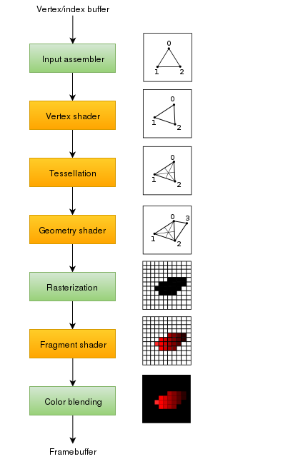

# Vulkan Tutorial 10 图形管线

## Introduction
通过接下来的章节，我们将会开启有关图形管线的话题，通过对图形渲染管线的配置完成最后的三角形绘画。
所谓图形管线就是将mesh使用到的vertices定点数据和贴图数据，转化为渲染targets像素的操作序列。简要的概述如下图所示:

 

Input assembler收集最原始的顶点数据，并且还可以使用索引缓冲区复用这些数据元素，而不必复制冗余的顶点数据副本。

vertex shader会应用在每一个顶点数据，通常应用变换操作，从而将顶点的位置坐标数据从模型空间转换为屏幕空间。在处理完毕之后会将数据继续在管线传递下去。

tessellation shader曲面着色器允许基于某些规则进一步细分几何数据增加网格的质量。经常应用与墙面和楼梯表面，使附近看起来不是那么平坦。

geometry shader集合着色器应用在每一个图元上，可用于增减图元，它与曲面着色器类似，但更加灵活。
        然而，它在今天的应用中并没有太多的应用情景，因为除了Intel的集成显卡外，大多数显卡性能支持都不理想。

光栅化阶段将图元分解为片元。这些是填充在帧缓冲区上的像素元素。屏幕外区域的片元会被丢弃，顶点着色器输出的数据在传递到片元着色器的过程中会进行内插值，如图所示。
除此之外，根据深度测试的结果也会对片元进行丢弃。

fragment shader应用于每个片元，确定每个帧缓冲区中写入的片元数据的颜色和深度值。片元着色器可以使用顶点着色器的插值数据，贴图的UV坐标和光源法线数据。

混色操作阶段会对不同片元的颜色进行混合，最终映射到帧缓冲区的同一个像素上。片元也可以简单的互相重写，叠加或者根据透明度混合。

绿色的阶段被称为固定流水线。这个阶段允许使用自定义的参数数值，但是它内部的工作逻辑是预制好的。

橙色的阶段被称为可编程阶段programmable，我们可以向GPU提交自己编写的代码执行具体的逻辑。比如在使用fragment shader的时候，可以实现任何从贴图到灯光的光线追踪。
这些程序同时运行在多核GPU上处理许多对象，比如并行的顶点和片段程序。

 
如果之前使用过旧的API(OpenGL和Direct3D),那么将可以随意通过glBlendFunc和OMSetBlendState调用更改管线设置。
Vulkan中的图形管线几乎不可改变，因此如果需要更改着色器，绑定到不同的帧缓冲区或者更改混合函数，则必须从头创建管线。
缺点是必须创建一些管线，这些管线代表在渲染操作中使用的不同的组合状态。但是由于所有管线的操作都是提前知道的，所以可以通过驱动程序更好的优化它。

 
一些可编程阶段是基于打算做什么而决定的。比如，如果只是简单的绘制几何图形，则可以禁用tessellation和geometry着色器。
如果只对深度值感兴趣，则可以禁用fragment着色器，这对于生成shadow map生成很有用。

在下一个章节中，我们首先创建将三角形放在屏幕上所需要的两个可编程阶段:vertice shader和fragment shader。
固定功能的设置包括blending mode, viewport, rasterization将在之后的章节中设置。在Vulkan中设置图形流水线的最后一部分内容涉及输入和输出帧缓冲区。

 

在initVulkan中创建函数createGraphicsPipeline并在createImageViews后立即调用。我们在下一章节介绍函数功能。

<pre>
void initVulkan() {
    createInstance();
    setupDebugCallback();
    createSurface();
    pickPhysicalDevice();
    createLogicalDevice();
    createSwapChain();
    createImageViews();
    createGraphicsPipeline();
}

...

void createGraphicsPipeline() {

}
</pre>

在结尾处分享一下Vulkan官方的图形管线结构图，如下:

  
  
  [代码](src/10.cpp)。