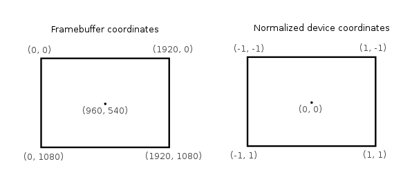
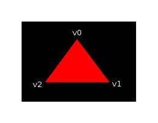
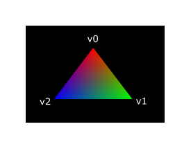

# Vulkan Tutorial 11 Shader modules

与之前的图像API不同，Vulkan中的着色器代码必须以二进制字节码的格式使用，而不是像GLSL和HLSL这样具有比较好的可读性的语法。
此字节格式成为SPIR-V，它可以与Vulkan和OpenCL一同使用。这是一种可以编写图形和计算着色器的格式，但我们重点介绍本教程中Vulkan
图形流水线使用的着色器。

 

使用二进制字节码格式的优点之一是 使得GPU厂商编写将着色器代码转换为本地代码的编译器复杂度减少了很多。
经验表明使用可读性比较强的语法，比如GLSL一些GPU厂商相当灵活地理解这个标准。这导致一种情况会发生，比如编写好，
并在一个厂商的GPU运行的不错的着色器程序，可能在其他的GPU厂商的GPU驱动程序运行异常，可能是语法的问题，
或者更糟的是不同GPU厂商编写的编译器差异，导致着色器运行错误。如果直接使用编译好的二进制字节码格式，可以避免这种情况。

 

但是，并不意味着我们要手写字节码。Khronos发布了与厂商无关的编译器，它将GLSL编译成SPIR-V。
该编译器用于验证着色器代码是否符合标准，并生成与Vulkan功能运行的SPRIR-V二进制文件。
除此之外还可以将此编译器作为库在运行时编译生成SPRI-V，但在本教程中不会这样操作。
编译器glslangValidator.exe包含在LunarG SDK中，因此不需要下载任何额外的内容。

 

GLSL是具有C风格语法的着色语言。在程序中需要定义编写main函数作为入口。GLSL不会使用输入参数和返回值作为输出，
而是使用全局变量来处理输入和输出。该语言包括很多功能简化图形编程，比如内置的基于向量和矩阵的叉积操作函数，矩阵和矢量乘法操作函数。
矢量类型为vec，数字表示分量的数量。例如3D位置存储在vec3中。可以通过诸如.x之类的成员访问单个分量，也可以通过多个分量创建一个新的向量。
比如，表达式vec3(1.0, 2.0, 3.0).xy截取前两个分量，并赋予新的vec2中。向量的构造函数也可以采用矢量对象和标量值的组合。
比如vec3可以用vec3(vec2(1.0, 2.0), 3.0)构造。

 

如前面提到的一样，我们需要编写一个vertex shader和一个fragment shader绘制三角形在屏幕。
下面两个小节会探讨与之相关的GLSL代码，并展示如何生成两个SPIR-V二进制文件，最后加载到程序中。

## Vertex shader
顶点着色器处理每一个顶点数据。它的属性，如世界坐标，颜色，法线和纹理UV坐标作为输入。
输出的是最终的clip coordinates 裁剪坐标和需要传递到片元着色器的属性，包括颜色和纹理UV坐标。
这些值会在光栅化阶段进行内插值，以产生平滑的过度。

 

裁剪坐标 clip coordinate 是一个来此顶点着色器的思维向量，随后通过矢量最后一个分量进行整体归一化操作。
这些归一化后的设备坐标是 homogeneous coordinates 最终映射到缓冲区范围为[-1, 1]的[-1, 1]坐标系统，如下所示:

 

如果之前的计算机图形比较熟悉的话，对这部分会比较熟悉。如果你之前使用过OpenGL，你会注意到Y坐标轴是反转的，
Z坐标轴的范围与Direct3D是一致的范围，从0到1.

对于第一个三角形，我们不会做任何转换操作，我们将三个顶点的位置指定为归一化设备坐标，创建如下图形:

 

我们可以通过将其输出为裁剪坐标直接输出归一化的设备坐标，顶点着色器的坐标与最后一个分量设置为 1。
将裁剪坐标转换为归一化的设备坐标没有改变任何东西。

通常情况下顶点坐标数据是存储在一个顶点缓冲区中，但是在Vulkan中创建一个顶点缓冲区并填充数据的过程并不是直接的。
所以我们后置这些步骤，直到我们满意的看到一个三角形出现在屏幕上。同时我们需要做一些非正统的事情:将坐标直接包含在顶点着色器的内部。
代码如下所示:

<pre>
#version 450
#extension GL_ARB_separate_shader_objects : enable

out gl_PerVertex {
    vec4 gl_Position;
};

vec2 positions[3] = vec2,
    vec2(0.5, 0.5),
    vec2(-0.5, 0.5)
);

void main() {
    gl_Position = vec4(positions[gl_VertexIndex], 0.0, 1.0);
}
</pre>

main函数的执行应用于每个顶点，内置的gl_VertexIndex变量包含了当前顶点的索引信息。通常是顶点缓冲区的索引，
但是在这里我们硬编码到顶点数据的集合中。每个顶点的位置从常量数组中访问，并与z和w分量组合使用，以产生裁剪坐标中的有效位置信息。
内置的gl_Position变量作为输出。最后Vulkan中使用shader，需要确保GL_ARG_separate_shader_objects扩展开启。

## Fragment shader

由顶点着色器的位置数据形成的三角形用片段着色器填充屏幕上的区域中。片段着色器针对一个或者多个framebuffer帧缓冲区的每个片元产生具体的颜色和
深度信息。一个简单的片段着色器为完成的三角形输出红色信息的代码如下:

<pre>
#version 450
#extension GL_ARB_separate_shader_objects : enable

layout(location = 0) out vec4 outColor;

void main() {
    outColor = vec4(1.0, 0.0, 0.0, 1.0);
}
</pre>

fragment sahder中的main函数与vertex shader中的main函数类似，会为每一个片元调用处理。
颜色的信息在GLSL中是4个分量组成的矢量，包括R,G,B和Alpha通道，值域收敛在[0, 1]范围内。
不像顶点着色器的gl_Position，它没有内置的变量为当前片元输出颜色信息。
在这里必须为framebuffer定义输出变量，layout(location = 0)修饰符明确framebuffer的索引。
红色信息写进outColor变量中，该变量链接第一个framebuffer中，索引为0。

## Per-vertex colors

一个纯红色的三角形看起来并不是很酷炫，为什么不试着酷炫一些呢?

 

我们针对两个类型的着色器尝试做一些改变，完成上图的效果。首先，我们需要为每个顶点设置差异化的颜色。
顶点着色器应该包含一个颜色数组，就像位置信息的数组一样:

<pre>
vec3 colors[3] = vec3,
    vec3(0.0, 1.0, 0.0),
    vec3(0.0, 0.0, 1.0)
);
</pre>

现在我们需要把每个顶点的颜色传递到片段着色器中，从而输出经过插值后的颜色信息到framebuffer中。
为顶点着色器添增加输出颜色支持，在main函数中定义如下:

<pre>
layout(location = 0) out vec3 fragColor;

void main() {
    gl_Position = vec4(positions[gl_VertexIndex], 0.0, 1.0);
    fragColor = colors[gl_VertexIndex];
}
</pre>

下一步，我们需要将片段着色器的输入匹配顶点着色器的输出:

<pre>
layout(location = 0) in vec3 fragColor;

void main() {
    outColor = vec4(fragColor, 1.0);
}
</pre>

输入的变量不一定要同名，它们将通过location索引指令链接在一起。main函数中修改将要输出的颜色alpha值。就像之前讨论的一样，
fragColor将会为三个顶点所属的片元自动进行内插值，形成平滑的颜色过度。

## Compiling the shaders
 在项目根目录下创建一个子目录，名shaders用于存储顶点着色器文件shader.vert和片段着色器文件shader.frag。
 GLSL着色器官方没有约定的扩展名，但是这两个扩展名是比较普遍通用的。

 

shader.vert内容如下:

<pre>
#version 450
#extension GL_ARB_separate_shader_objects : enable

out gl_PerVertex {
    vec4 gl_Position;
};

layout(location = 0) out vec3 fragColor;

vec2 positions[3] = vec2,
    vec2(0.5, 0.5),
    vec2(-0.5, 0.5)
);

vec3 colors[3] = vec3,
    vec3(0.0, 1.0, 0.0),
    vec3(0.0, 0.0, 1.0)
);

void main() {
    gl_Position = vec4(positions[gl_VertexIndex], 0.0, 1.0);
    fragColor = colors[gl_VertexIndex];
}
</pre>

shader.frag文件内容如下:

<pre>
#version 450
#extension GL_ARB_separate_shader_objects : enable

layout(location = 0) in vec3 fragColor;

layout(location = 0) out vec4 outColor;

void main() {
    outColor = vec4(fragColor, 1.0);
}
</pre>

现在我们尝试使用glslangValidator程序编译SPIR-V二进制码。

## Windows
创建一个compile.bat批处理文件，内容如下:

C:/VulkanSDK/1.0.17.0/Bin32/glslangValidator.exe -V shader.vert
C:/VulkanSDK/1.0.17.0/Bin32/glslangValidator.exe -V shader.frag
pause
将glslangValidator.exe的path路径替换为你的VulkanSDK安装路径，然后双击该文件运行。

###  End of platform-specific instructions
这两个命令使用-V标志调用编译器，该标志告诉它将GLSL源文件编译为SPIR-V字节码。
运行编译脚本时，会看到创建了两个SPIR-V二进制文件:vert.spv和frag.spv。
这些名称从着色器中派生而来，但是可以重命名为任何名字。
在编译着色器时，可能收到关于某些功能缺失的警告信息，在这里放心的忽略它们。

如果着色器包含语法错误，那么编译器会按照您的预期告诉具体的行号和问题。
尝试省略一个分号，然后重新运行编译脚本。还可以尝试运行编译器，而无需任何参数来查看它支持哪些类型的标志。
例如，它可以将字节码输出为可读的格式，以便准确了解着色器正在执行的操作以及在此阶段应用的任何优化。

## Loading a shader
现在我们有一种产生SPIR-V着色器的方法，是时候加载它们到我们的程序中，以便在适当的时候插入到图形管线中。
首先我们编写一个辅助函数用以加载二进制数据文件。

<pre>
#include <fstream>

...

static std::vector<char> readFile(const std::string& filename) {
    std::ifstream file(filename, std::ios::ate | std::ios::binary);

    if (!file.is_open()) {
        throw std::runtime_error("failed to open file!");
    }
}
</pre>

readFile函数将会从文件中读取所有的二进制数据，并用std::vector字节集合管理。我们使用两个标志用以打开文件:

* ate:在文件末尾开始读取
* binary:以二进制格式去读文件(避免字符格式的转义)

从文件末尾开始读取的优点是我们可以使用读取位置来确定文件的大小并分配缓冲区:

<pre>
size_t fileSize = (size_t) file.tellg();
std::vector<char> buffer(fileSize);
</pre>

之后我们可以追溯到文件的开头，同时读取所有的字节:

file.seekg(0);
file.read(buffer.data(), fileSize);
最后关闭文件，返回字节数据:

file.close();

return buffer;
我们调用函数createGraphicsPipeline加载两个着色器的二进制码:

<pre>
void createGraphicsPipeline() {
    auto vertShaderCode = readFile("shaders/vert.spv");
    auto fragShaderCode = readFile("shaders/frag.spv");
}
</pre>

确保着色器正确加载，并打印缓冲区的大小是否与文件实际大小一致。

## Creating shader modules
在将代码传递给渲染管线之前，我们必须将其封装到VkShaderModule对象中。
让我们创建一个辅助函数createShaderModule实现该逻辑。

<pre>
VkShaderModule createShaderModule(const std::vector<char>& code) {

}
</pre>

该函数需要字节码的缓冲区作为参数，并通过缓冲区创建VkShaderModule。

创建shader module是比较简单的，我们仅仅需要指定二进制码缓冲区的指针和它的具体长度。
这些信息被填充在VkShaderModuleCreateInfo结构体中。需要留意的是字节码的大小是以字节指定的，
但是字节码指针是一个uint32_t类型的指针，而不是一个char指针。所以我们使用reinterpret_cast进行转换指针。
如下所示，当需要转换时，还需要确保数据满足uint32_t的对齐要求。幸运的是，数据存储在std::vector中，
默认分配器已经确保数据满足最差情况下的对齐要求。

<pre>
VkShaderModuleCreateInfo createInfo = {};
createInfo.sType = VK_STRUCTURE_TYPE_SHADER_MODULE_CREATE_INFO;
createInfo.codeSize = code.size();

createInfo.pCode = reinterpret_cast<const uint32_t*>(code.data());
</pre>

调用vkCreateShaderMoudle创建VkShaderModule:

<pre>
VkShaderModule shaderModule;
if (vkCreateShaderModule(device, &createInfo, nullptr, &shaderModule) != VK_SUCCESS) {
    throw std::runtime_error("failed to create shader module!");
}
</pre>

参数与之前创建对象功能类似:逻辑设备，创建对象信息结构体的指针，自定义分配器和保存结果的句柄变量。
在shader module创建完毕后，可以对二进制码的缓冲区进行立即的释放。最后不要忘记返回创建好的shader module。

return shaderModule;

shader module对象仅仅在渲染管线处理过程中需要，所以我们会在createGraphicsPipeline函数中定义本地变量保存它们，
而不是定义类成员变量持有它们的句柄:

<pre>
VkShaderModule vertShaderModule;
VkShaderModule fragShaderModule;
</pre>

调用加载shader module的辅助函数:

vertShaderModule = createShaderModule(vertShaderCode);
fragShaderModule = createShaderModule(fragShaderCode);
在图形管线创建完成且createGraphicsPipeline函数返回的时候，它们应该被清理掉，所以在该函数后删除它们:

<pre>
 ...
    vkDestroyShaderModule(device, fragShaderModule, nullptr);
    vkDestroyShaderModule(device, vertShaderModule, nullptr);
}
</pre>

## Shader stage creation
VkShaderModule对象只是字节码缓冲区的一个包装容器。着色器并没有彼此链接，甚至没有给出目的。
通过VkPipelineShaderStageCreateInfo结构将着色器模块分配到管线中的顶点或者片段着色器阶段。
VkPipelineShaderStageCreateInfo结构体是实际管线创建过程的一部分。

 
我们首先在createGraphicsPipeline函数中填写顶点着色器结构体。

<pre>
VkPipelineShaderStageCreateInfo vertShaderStageInfo = {};
vertShaderStageInfo.sType = VK_STRUCTURE_TYPE_PIPELINE_SHADER_STAGE_CREATE_INFO;
vertShaderStageInfo.stage = VK_SHADER_STAGE_VERTEX_BIT;
</pre>

除了强制的sType成员外，第一个需要告知Vulkan将在哪个流水线阶段使用着色器。在上一个章节的每个可编程阶段都有一个对应的枚举值。

<pre>
vertShaderStageInfo.module = vertShaderModule;
vertShaderStageInfo.pName = "main";
</pre>

接下来的两个成员指定包含代码的着色器模块和调用的主函数。这意味着可以将多个片段着色器组合到单个着色器模块中，
并使用不同的入口点来区分它们的行为。在这种情况下，我们坚持使用标准main函数作为入口。

还有一个可选成员，pSpecializationInfo,在这里我们不会使用它，但是值得讨论一下。它允许为着色器指定常量值。
使用单个着色器模块，通过为其中使用不同的常量值，可以在流水线创建时对行为进行配置。这比在渲染时使用变量配置着色器更有效率，
因为编译器可以进行优化，例如消除if值判断的语句。如果没有这样的常量，可以将成员设置为nullptr，我们的struct结构体初始化自动进行。

修改结构体满足片段着色器的需要:

<pre>
VkPipelineShaderStageCreateInfo fragShaderStageInfo = {};
fragShaderStageInfo.sType = VK_STRUCTURE_TYPE_PIPELINE_SHADER_STAGE_CREATE_INFO;
fragShaderStageInfo.stage = VK_SHADER_STAGE_FRAGMENT_BIT;
fragShaderStageInfo.module = fragShaderModule;
fragShaderStageInfo.pName = "main";
</pre>

完成两个结构体的创建，并通过数组保存，这部分引用将会在实际的管线创建开始。

VkPipelineShaderStageCreateInfo shaderStages[] = {vertShaderStageInfo, fragShaderStageInfo};  
到此为止，就是所有关于可编程管线阶段的逻辑。在下一章节我们会看一下固定管线各个阶段。

[代码](src/11.cpp)。
