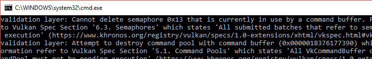

# Vulkan Tutorial 17 Rendering and presentation

## Setup
这一章节会把之前的所有内容进行整合。我们将会编写drawFrame函数，通过主循环main loop将三角形绘制到屏幕。在mainLoop函数调用:

<pre>
void mainLoop() {
    while (!glfwWindowShouldClose(window)) {
        glfwPollEvents();
        drawFrame();
    }
}

...

void drawFrame() {

}
</pre>

## Synchronization

drawFrame函数将会执行如下操作:

* 从交换链中获取一个图像
* 在帧缓冲区中，使用作为附件的图像来执行命令缓冲区中的命令
* 为了最终呈现，将图像返还到交换链

每个事件派发都有一个函数调用来对应，但它们的执行是异步的。函数调用将在操作实际完成之前返回，并且执行顺序也是未定义的。
这是不理想的，因为每一个操作都取决于前一个操作。

同步交换链事件有两种方法:栅栏和信号量。它们都是可以通过使用一个操作信号，负责协调操作的对象。
另一个操作等待栅栏或者信号量从无信号状态转变到有信号状态。

不同之处在于可以在应用程序中调用vkWaitForFence进入栅栏状态，而信号量不可以。
栅栏主要用于应用程序自身与渲染操作进行同步，
而信号量用于在命令队列内或者跨命令队列同步操作。
我们期望同步绘制与呈现的队列操作，所以使用信号量最合适。

## Semaphores
在获得一个图像时，我们需要发出一个信号量准备进行渲染，另一个信号量的发出用于渲染结束，准备进行呈现presentation。
创建两个成员变量存储信号量对象:

VkSemaphore imageAvailableSemaphore;
VkSemaphore renderFinishedSemaphore;
为了创建信号量semaphores，我们将要新增本系列教程最后一个函数: createSemaphores:

<pre>
void initVulkan() {
    createInstance();
    setupDebugCallback();
    createSurface();
    pickPhysicalDevice();
    createLogicalDevice();
    createSwapChain();
    createImageViews();
    createRenderPass();
    createGraphicsPipeline();
    createFramebuffers();
    createCommandPool();
    createCommandBuffers();
    createSemaphores();
}

...

void createSemaphores() {

}
</pre>

创建信号量对象需要填充VkSemaphoreCreateInfo结构体，但是在当前版本的API中，实际上不需要填充任何字段，除了sType:

<pre>
void createSemaphores() {
    VkSemaphoreCreateInfo semaphoreInfo = {};
    semaphoreInfo.sType = VK_STRUCTURE_TYPE_SEMAPHORE_CREATE_INFO;
}
</pre>

Vulkan API未来版本或者扩展中或许会为flags和pNext参数增加功能选项。创建信号量对象的过程很熟悉了，在这里使用vkCreateSemaphore:

<pre>
if (vkCreateSemaphore(device, &semaphoreInfo, nullptr, &imageAvailableSemaphore) != VK_SUCCESS ||
    vkCreateSemaphore(device, &semaphoreInfo, nullptr, &renderFinishedSemaphore) != VK_SUCCESS) {

    throw std::runtime_error("failed to create semaphores!");
}
</pre>

在程序结束时，当所有命令完成并不需要同步时，应该清除信号量:

<pre>
void cleanup() {
    vkDestroySemaphore(device, renderFinishedSemaphore, nullptr);
    vkDestroySemaphore(device, imageAvailableSemaphore, nullptr);
}
</pre>

## Acquiring an image from the swap chain
就像之前说到的，drawFrame函数需要做的第一件事情就是从交换链中获取图像。
回想一下交换链是一个扩展功能，所以我们必须使用具有vk*KHR命名约定的函数:

<pre>
void drawFrame() {
    uint32_t imageIndex;
    vkAcquireNextImageKHR(device, swapChain, std::numeric_limits<uint64_t>::max(), imageAvailableSemaphore, VK_NULL_HANDLE, &imageIndex);
}
</pre>

vkAcquireNextImageKHR函数前两个参数是我们希望获取到图像的逻辑设备和交换链。
第三个参数指定获取有效图像的操作timeout，单位纳秒。我们使用64位无符号最大值禁止timeout。

接下来的两个参数指定使用的同步对象，当presentation引擎完成了图像的呈现后会使用该对象发起信号。
这就是开始绘制的时间点。它可以指定一个信号量semaphore或者栅栏或者两者。出于目的性，我们会使用imageAvailableSemaphore。

最后的参数指定交换链中成为available状态的图像对应的索引。其中索引会引用交换链图像数组swapChainImages的图像VkImage。
我们使用这个索引选择正确的命令缓冲区。

## Submitting the command buffer
队列提交和同步通过VkSubmitInfo结构体进行参数配置。

<pre>
VkSubmitInfo submitInfo = {};  
submitInfo.sType = VK_STRUCTURE_TYPE_SUBMIT_INFO;  

VkSemaphore waitSemaphores[] = {imageAvailableSemaphore};
VkPipelineStageFlags waitStages[] = {VK_PIPELINE_STAGE_COLOR_ATTACHMENT_OUTPUT_BIT};
submitInfo.waitSemaphoreCount = 1;
submitInfo.pWaitSemaphores = waitSemaphores;
submitInfo.pWaitDstStageMask = waitStages;
</pre>

前三个参数指定在执行开始之前要等待的哪个信号量及要等待的通道的哪个阶段。
为了向图像写入颜色，我们会等待图像状态变为available，所我们指定写入颜色附件的图形管线阶段。
理论上这意味着，具体的顶点着色器开始执行，而图像不可用。waitStages数组对应pWaitSemaphores中具有相同索引的信号量。

submitInfo.commandBufferCount = 1;  
submitInfo.pCommandBuffers = &commandBuffers[imageIndex];  

接下来的两个参数指定哪个命令缓冲区被实际提交执行。如初期提到的，我们应该提交命令缓冲区，它将我们刚获取的交换链图像做为颜色附件进行绑定。

<pre>
VkSemaphore signalSemaphores[] = {renderFinishedSemaphore};
submitInfo.signalSemaphoreCount = 1;
submitInfo.pSignalSemaphores = signalSemaphores;
</pre>

signalSemaphoreCount和pSignalSemaphores参数指定了当命令缓冲区执行结束向哪些信号量发出信号。根据我们的需要使用renderFinishedSemaphore。

<pre>
if (vkQueueSubmit(graphicsQueue, 1, &submitInfo, VK_NULL_HANDLE) != VK_SUCCESS) {
    throw std::runtime_error("failed to submit draw command buffer!");
}
</pre>

使用vkQueueSubmit函数向图像队列提交命令缓冲区。当开销负载比较大的时候，处于效率考虑，函数可以持有VkSubmitInfo结构体数组。最后一个参数引用了一个可选的栅栏，当命令缓冲区执行完毕时候它会被发送信号。我们使用信号量进行同步，所以我们需要传递VK_NULL_HANDLE。

## Subpass dependencies
请记住，渲染通道中的子通道会自动处理布局的变换。这些变换通过子通道的依赖关系进行控制，它们指定了彼此之间内存和执行的依赖关系。
现在只有一个子通道，但是在此子通道之前和之后的操作也被视为隐式“子通道”。

有两个内置的依赖关系在渲染通道开始和渲染通道结束处理转换，但是前者不会在当下发生。
假设转换发生在管线的起始阶段，但是我们还没有获取图像！有两个方法处理这个问题可以将imageAvailableSemaphore的waitStages
更改为VK_PIPELINE_STAGE_TOP_OF_PIPE_BIT，确保图像有效之前渲染通道不会开始，
或者我们让渲染通道等待VK_PIPELINE_STAGE_COLOR_ATTACHMENT_OUTPUT_BIT阶段。
我觉得使用第二个选项，因为可以比较全面的了解subpass依赖关系及其工作方式。

子通道依赖关系可以通过VkSubpassDependency结构体指定，在createRenderPass函数中添加:

<pre>
VkSubpassDependency dependency = {}; 
dependency.srcSubpass = VK_SUBPASS_EXTERNAL; 
dependency.dstSubpass = 0; 
</pre>

前两个参数指定依赖的关系和从属子通道的索引。特殊值VK_SUBPASS_EXTERNAL是指在渲染通道之前或者之后的隐式子通道，
取决于它是否在srcSubpass或者dstSubPass中指定。索引0指定我们的子通道，这是第一个也是唯一的。
dstSubpass必须始终高于srcSubPass以防止依赖关系出现循环。

dependency.srcStageMask = VK_PIPELINE_STAGE_COLOR_ATTACHMENT_OUTPUT_BIT;  
dependency.srcAccessMask = 0;  

 接下来的两个参数字段指定要等待的操作和这些操作发生的阶段。在我们可以访问对象之前，我们需要等待交换链完成对应图像的读取操作。
 这可以通过等待颜色附件输出的阶段来实现。

dependency.dstStageMask = VK_PIPELINE_STAGE_COLOR_ATTACHMENT_OUTPUT_BIT;  
dependency.dstAccessMask = VK_ACCESS_COLOR_ATTACHMENT_READ_BIT | VK_ACCESS_COLOR_ATTACHMENT_WRITE_BIT;  
在颜色附件阶段的操作及涉及颜色附件的读取和写入的操作应该等待。这些设置将阻止转换发生，直到实际需要(并允许):当我们需要写入颜色时候。

renderPassInfo.dependencyCount = 1;  
renderPassInfo.pDependencies = &dependency;  
VkRenderPassCreateInfo结构体有两个字段指定依赖的数组。

## Presentation
绘制帧最后一个步骤是将结果提交到交换链，使其最终显示在屏幕上。Presentation通过VkPresentInfoKHR结构体配置，具体位置在drawFrame函数最后。

<pre>
VkPresentInfoKHR presentInfo = {};
presentInfo.sType = VK_STRUCTURE_TYPE_PRESENT_INFO_KHR;

presentInfo.waitSemaphoreCount = 1;
presentInfo.pWaitSemaphores = signalSemaphores;
</pre>

前两个参数指定在进行presentation之前要等待的信号量，就像VkSubmitInfo一样。

<pre>
VkSwapchainKHR swapChains[] = {swapChain};
presentInfo.swapchainCount = 1;
presentInfo.pSwapchains = swapChains;
presentInfo.pImageIndices = &imageIndex;
</pre>

接下来的两个参数指定用于提交图像的交换链和每个交换链图像索引。大多数情况下仅一个。

presentInfo.pResults = nullptr; // Optional  
最后一个可选参数pResults，它允许指定一组VkResult值，以便在presentation成功时检查每个独立的交换链。
如果只使用单个交换链，则不需要，因为可以简单的使用当前函数的返回值。

vkQueuePresentKHR(presentQueue, &presentInfo);  
vkQueuePresentKHR函数提交请求呈现交换链中的图像。我们在下一个章节为vkAcquireNextImageKHR和vkQueuePresentKHR可以添加错误处理。
因为它们失败并不一定意味着程序应该终止，与我们迄今为止看到的功能不同。

如果一切顺利，当再次运行程序时候，应该可以看到一下内容:

 

遗憾的是，只要程序关闭，由于开启了validation layers你将会看到程序崩溃的信息。从终端控制台打印的信息来源debugCallback，
告诉了我们具体的原因:

 

需要了解的是drawFrame函数中所有的操作都是异步的。意味着当程序退出mainLoop，绘制和呈现操作可能仍然在执行。所以清理该部分的资源是不友好的。

 

为了解决这个问题，我们应该在退出mainLoop销毁窗体前等待逻辑设备的操作完成:

<pre>
void mainLoop() {
    while (!glfwWindowShouldClose(window)) {
        glfwPollEvents();
        drawFrame();
    }

    vkDeviceWaitIdle(device);
}
</pre>

也可以使用vkQueueWaitIdle等待特定命令队列中的操作完成。这些功能可以作为一个非常基本的方式来执行同步。这个时候窗体关闭后该问题不会出现。

##  Memory leak
如果运行时启用了validation layers并监视应用程序的内存使用情况，你会发现它在慢慢增加。
原因是validation layers的实现期望与GPU同步。虽然在技术上是不需要的，但是一旦这样做，每一针帧不会出现明显的性能影响。

我们可以在开始绘制下一帧之前明确的等待presentation完成:

<pre>
void drawFrame() {
    ...

    vkQueuePresentKHR(presentQueue, &presentInfo);

    vkQueueWaitIdle(presentQueue);
}
</pre>

在很多应用程序的的状态也会在每一帧更新。为此更高效的绘制一阵的方式如下：

<pre>
void drawFrame() {
    updateAppState();
    
    vkQueueWaitIdle(presentQueue);

    vkAcquireNextImageKHR(...)

    submitDrawCommands();

    vkQueuePresentKHR(presentQueue, &presentInfo);
}
</pre>

该方法允许我们更新应用程序的状态，比如运行游戏的AI协同程序，而前一帧被渲染。这样，始终保持CPU和GPU处于工作状态。

## Conclusion
大约800行代码之后，我们终于看到了三角形绘制在屏幕上！Vulkan引导程序需要很多的工作要去做，但好处是Vulkan通过要求每一个明确的实现，
带来了了巨大的控制权。建议花费一些时间重新读代码，并建立一个思维导图模型，目的在于了解Vulkan中每一个对象，以及它们的互相的关系。
之后我们将会基于这个基础构建扩展程序功能。

在下一章节中，我们将细化Vulkan程序中的一些细节，使其表现更稳定。

[代码](src/17.cpp)。
