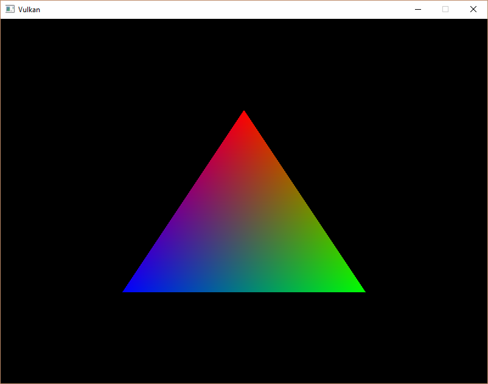

# Vulkan Tutorial 20 Vertex buffer creation

## Introduction
在Vulkan中，缓冲区是内存的一块区域，该区域用于向显卡提供预要读取的任意数据。
它们可以用来存储顶点数据，也可以用于其他目的。与之前创建的Vulkan对象不同的是，缓冲区自己不会分配内存空间。
前几个章节了解到，Vulkan API使开发者控制所有的实现，内存管理是其中一个非常重要的环节。

## Buffer creation
添加新的函数createVertexBuffer，并在initVulkan函数中的createCommandBuffers函数之前调用。

<pre>
void initVulkan() {
    createInstance();
    setupDebugCallback();
    createSurface();
    pickPhysicalDevice();
    createLogicalDevice();
    createSwapChain();
    createImageViews();
    createRenderPass();
    createGraphicsPipeline();
    createFramebuffers();
    createCommandPool();
    createVertexBuffer();
    createCommandBuffers();
    createSemaphores();
}

...

void createVertexBuffer() {

}
</pre>

创建缓冲区需要填充VkBufferCreateInfo结构体。

<pre>
VkBufferCreateInfo bufferInfo = {};
bufferInfo.sType = VK_STRUCTURE_TYPE_BUFFER_CREATE_INFO;
bufferInfo.size = sizeof(vertices[0]) * vertices.size();
</pre>

结构体的第一个字段size指定缓冲区字节大小。计算缓冲区每个顶点数据的字节大小可以直接使用sizeof。

bufferInfo.usage = VK_BUFFER_USAGE_VERTEX_BUFFER_BIT;
第二个字段usage，表示缓冲区的数据将如何使用。可以使用位操作指定多个使用目的。
我们的案例将会使用一个顶点缓冲区，我们将会在未来的章节使用其他的用法。

bufferInfo.sharingMode = VK_SHARING_MODE_EXCLUSIVE;
就像交换链中的图像一样，缓冲区也可以由特定的队列簇占有或者多个同时共享。
在我们的案例中缓冲区将会被用于图形队列，所以我们坚持使用独占访问模式exclusive mode。

flags参数用于配置稀疏内存缓冲区，现在关于flags的设置是无关紧要的，所以我们默认填0.

我们使用vkCreateBuffer函数创建缓冲区。定义一个类成员vertexBuffer存储缓冲区句柄。

<pre>
VkBuffer vertexBuffer;

...

void createVertexBuffer() {
    VkBufferCreateInfo bufferInfo = {};
    bufferInfo.sType = VK_STRUCTURE_TYPE_BUFFER_CREATE_INFO;
    bufferInfo.size = sizeof(vertices[0]) * vertices.size();
    bufferInfo.usage = VK_BUFFER_USAGE_VERTEX_BUFFER_BIT;
    bufferInfo.sharingMode = VK_SHARING_MODE_EXCLUSIVE;

    if (vkCreateBuffer(device, &bufferInfo, nullptr, &vertexBuffer) != VK_SUCCESS) {
        throw std::runtime_error("failed to create vertex buffer!");
    }
}
</pre>

缓冲区在程序退出之前为渲染命令rendering command提供支持，并且不依赖交换链，我们在cleanup函数中清理。

<pre>
void cleanup() {
    cleanupSwapChain();

    vkDestroyBuffer(device, vertexBuffer, nullptr);

    ...
}
</pre>

## Memory requirements
虽然缓冲区创建完成了，但是实际上并没有分配任何可用内存。给缓冲区分配内存的第一步是vkGetBufferMemoryRequirements函数查询内存需求。

<pre>
VkMemoryRequirements memRequirements;
vkGetBufferMemoryRequirements(device, vertexBuffer, &memRequirements);
</pre>

VkMemoryRequirements结构体有三个字段：

* size: 需要的内存字节大小，可能与bufferInfo.size大小不一致。
* alignment: 缓冲区的内存分配区域开始的字节偏移量，它取决于bufferInfo.usage和bufferInfo.flags。
* memoryTypeBits: 适用于缓冲区的存储器类型的位字段。
显卡可以分配不同类型的内存。每种类型的内存根据所允许的操作和特性均不相同。
我们需要结合缓冲区与应用程序实际的需要找到正确的内存类型使用。
现在添加一个新的函数完成此逻辑findMemoryType。

<pre>
uint32_t findMemoryType(uint32_t typeFilter, VkMemoryPropertyFlags properties) {

}
</pre>

首先需要通过vkGetPhysicalDeviceMemoryProperties函数遍历有效的内存类型。

VkPhysicalDeviceMemoryProperties memProperties;  
vkGetPhysicalDeviceMemoryProperties(physicalDevice, &memProperties);  

VkPhysicalDeviceMemoryProperties结构体有两个数组，一个是memoryTypes，另一个是memoryHeaps。
内存堆是比较特别的内存资源，类似VRAM内存以及在VRAM消耗尽时进行 swap space 中的RAM。
在堆中存在不同类型的内存。现在我们专注内存类型本身，而不是堆的来源。但是可以想到会影响到性能。

我们首先为缓冲区找到合适的内存类型:

<pre>
for (uint32_t i = 0; i < memProperties.memoryTypeCount; i++) {
    if (typeFilter & (1 << i)) {
        return i;
    }
}
throw std::runtime_error("failed to find suitable memory type!");
</pre>

typeFilter参数将以位的形式代表适合的内存类型。这意味着通过简单的迭代内存属性集合，
并根据需要的类型与每个内存属性的类型进行AND操作，判断是否为1。

然而，不仅仅对vertex buffer顶点缓冲区的内存类型感兴趣。还需要将顶点数据写入内存。
memoryTypes数组是由VkMemoryType结构体组成的，它描述了堆以及每个内存类型的相关属性。
属性定义了内存的特殊功能，就像内存映射功能，使我们可以从CPU向它写入数据。
此属性由VK_MEMORY_PROPERTY_HOST_VISIBLE_BIT定义，但是我们还需要使用VK_MEMORY_PROPERTY_HOST_CHOERENT_BIT属性。
当我们进行内存映射的时候会看到它们。

我们修改loop循环，并使用这些属性作为内存筛选条件：

<pre>
for (uint32_t i = 0; i < memProperties.memoryTypeCount; i++) {
    if ((typeFilter & (1 << i)) && (memProperties.memoryTypes[i].propertyFlags & properties) == properties) {
        return i;
    }
}
</pre>

在将来我们可能不止一个所需属性，所以我们应该检查按位AND的结果是否为零，而不是直接等于期望的属性位字段。
如果有一个内存类型适合我们的缓冲区，它也具有需要的所有属性，那么我们就返回它的索引，否则我们抛出一个异常信息。

## Memory allocation
我们现在决定了正确的内存类型，所以我们可以通过VkMemoryAllocateInfo结构体分配内存。

<pre>
VkMemoryAllocateInfo allocInfo = {};
allocInfo.sType = VK_STRUCTURE_TYPE_MEMORY_ALLOCATE_INFO;
allocInfo.allocationSize = memRequirements.size;
allocInfo.memoryTypeIndex = findMemoryType(memRequirements.memoryTypeBits, VK_MEMORY_PROPERTY_HOST_VISIBLE_BIT | VK_MEMORY_PROPERTY_HOST_COHERENT_BIT);
</pre>

内存分配简单的指定大小和类型参数，这两个参数是从之前为顶点缓冲区设置的内存需求结构体和所需属性带过来的。
创建一个类成员，存储使用vkAllocateMemory函数分配的内存句柄。

<pre>
VkBuffer vertexBuffer;
VkDeviceMemory vertexBufferMemory;

...

if (vkAllocateMemory(device, &allocInfo, nullptr, &vertexBufferMemory) != VK_SUCCESS) {
    throw std::runtime_error("failed to allocate vertex buffer memory!");
}
</pre>

如果内存分配成功，我们使用vkBindBufferMemory函数将内存关联到缓冲区：

vkBindBufferMemory(device, vertexBuffer, vertexBufferMemory, 0);
前三个参数已经不言自明了，第四个参数是内存区域的偏移量。因为这个内存被专门为顶点缓冲区分配，偏移量设置为0。
如果偏移量non-zero，那么需要通过memRequirements.alignment整除。

当然，就像在C++动态分配内存一样，所分配的内存需要在某个节点释放。
当缓冲区不再使用时，绑定到缓冲区对象的内存获取会被释放，所以让我们在缓冲区被销毁后释放它们：

<pre>
void cleanup() {
    cleanupSwapChain();

    vkDestroyBuffer(device, vertexBuffer, nullptr);
    vkFreeMemory(device, vertexBufferMemory, nullptr);
}
</pre>

## Filling the vertex buffer
现在将顶点数据Copy到缓冲区。使用vkMapMemory将缓冲区内存映射(mapping the buffer memory)到CPU可访问的内存中完成。 

void* data;  
vkMapMemory(device, vertexBufferMemory, 0, bufferInfo.size, 0, &data);  

该功能允许我们访问由偏移量和大小指定的内存资源的区域。在这里offset和size分别是0和bufferInfo.size，
还可以指定特殊值VK_WHOLE_SIZE来映射所有内存。第二个到最后一个参数可以用于指定标志位，但是当前版本的API还没有可用的参数。它必须设置为0。

<pre>
void* data;
vkMapMemory(device, vertexBufferMemory, 0, bufferInfo.size, 0, &data);
memcpy(data, vertices.data(), (size_t) bufferInfo.size);
vkUnmapMemory(device, vertexBufferMemory);
</pre>

可以简单的通过memcpy将顶点数据拷贝到映射内存中，并使用vkUnmapMemory取消映射。
不幸的是，驱动程序是不会立即将数据复制到缓冲区中，比如缓存的原因。
也可能尝试映射的内存对于写缓冲区操作不可见。处理该类问题有两种方法：

使用主机一致的内存堆空间，用VK_MEMORY_PROPERTY_HOST_COHERENT_BIT指定
当完成写入内存映射操作后，调用vkFlushMappedMemoryRanges函数，当读取映射内存之前，调用vkInvalidateMappedMemoryRanges函数
我们使用第一个方式，它确保了映射的内存总是与实际分配的内存一致。
需要了解的是，这种方式与明确flushing操作相比，可能对性能有一点减损。但是我们在下一章会了解为什么无关紧要。

## Binding the vertex buffer
现在讨论渲染期间绑定缓冲区操作。我们将会扩展createCommandBuffers函数。

<pre>
vkCmdBindPipeline(commandBuffers[i], VK_PIPELINE_BIND_POINT_GRAPHICS, graphicsPipeline);

VkBuffer vertexBuffers[] = {vertexBuffer};
VkDeviceSize offsets[] = {0};
vkCmdBindVertexBuffers(commandBuffers[i], 0, 1, vertexBuffers, offsets);

vkCmdDraw(commandBuffers[i], static_cast<uint32_t>(vertices.size()), 1, 0, 0);
</pre>

vkCmdBindVertexBuffers函数用于绑定顶点缓冲区，就像之前的设置一样，除了命令缓冲区之外，
前两个参数指定了我们要为其指定的顶点缓冲区的偏移量和数量。最后两个参数指定了将要绑定的顶点缓冲区的数组及开始读取数据的起始偏移量。
最后调用vkCmdDraw函数传递缓冲区中顶点的数量，而不是硬编码3。

现在运行程序可以看到正确的三角形绘制：

 

尝试修改上面顶点的颜色为白色white，修改vertices数组如下：

<pre>
const std::vector<Vertex> vertices = {
    {{0.0f, -0.5f}, {1.0f, 1.0f, 1.0f}},
    {{0.5f, 0.5f}, {0.0f, 1.0f, 0.0f}},
    {{-0.5f, 0.5f}, {0.0f, 0.0f, 1.0f}}
};
</pre>

再次运行程序看到如下图：

 

在下一章节中，我们将会介绍将顶点数据复制到顶点缓冲区的不同方式，从而实现更好的性能，但需要更多的工作。

[代码](src/20.cpp)。
