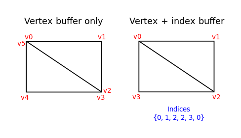
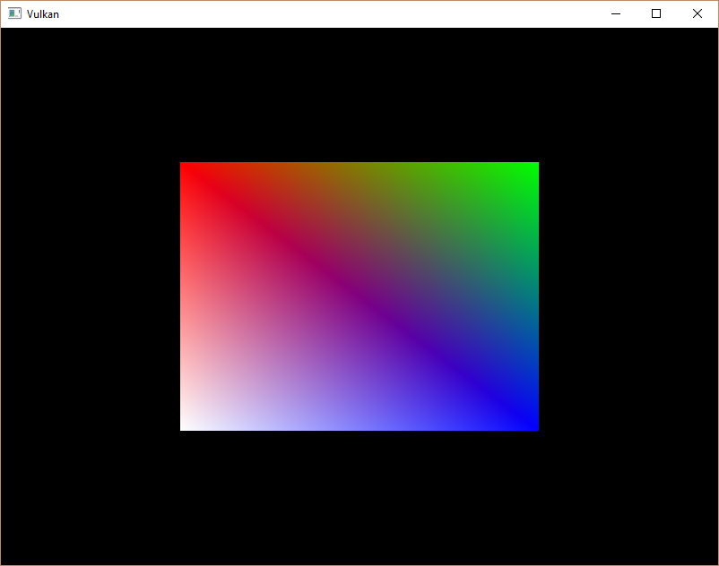

# Vulkan Tutorial 22 Index buffer

## Introduction
在实际产品的运行环境中3D模型的数据往往共享多个三角形之间的顶点数据。即使绘制一些简单的图形也是如此，比如矩形：

 

绘制矩形需要两个三角形，通常意味着我们需要6个顶点数据。问题是其中的两个顶点会重复，导致数据会有50%的冗余。
如果更复杂的模型，该问题会更加严重，平均每三个三角形就会发生重复顶点使用的情况。
解决问题的方法是使用index buffer，即索引缓冲区。

索引缓冲区纯粹是一个指向顶点缓冲区的指针数组。它允许我们重排列顶点数据，并复用多个已经存在的顶点数据。
上图显示了有一个包含四个不重复顶点数据的顶点缓冲区，通过索引缓冲区将如何显示矩形的情况。
前三个索引定义右上角的三角形，最后三个索引定义了左下角的三角形。

##  Index buffer creation
在本章节中，为了绘制如上图所示的矩形，我们需要修改顶点数据并添加索引数据。修改后的顶点数据分别代表矩形四个角：

<pre>
const std::vector<Vertex> vertices = {
    {{-0.5f, -0.5f}, {1.0f, 0.0f, 0.0f}},
    {{0.5f, -0.5f}, {0.0f, 1.0f, 0.0f}},
    {{0.5f, 0.5f}, {0.0f, 0.0f, 1.0f}},
    {{-0.5f, 0.5f}, {1.0f, 1.0f, 1.0f}}
};
</pre>

左上角是红色，右上角是绿色，右下角是蓝色，左下角是白色。我们添加一个新的索引数组indices代表索引缓冲区的数据内容。
它应该匹配途中的索引来绘制右上角的三角形和左下角的三角形。

<pre>
const std::vector<uint16_t> indices = {
    0, 1, 2, 2, 3, 0
};
</pre>

根据vertices中的条目个数，我们可以使用uint16_t或uint32_t作为索引缓冲区类型。现在我们可以使用uint16_t，
因为我们使用的独立顶点数量小于65535。

如顶点数据，为了使GPU可以访问到它们，需要将索引数据上传到缓冲区VkBuffer。定义两个类成员保存索引缓冲区的资源：

<pre>
VkBuffer vertexBuffer;
VkDeviceMemory vertexBufferMemory;
VkBuffer indexBuffer;
VkDeviceMemory indexBufferMemory;
createIndexBuffer函数与之前的createVertexBuffer函数非常类似：

void initVulkan() {
    ...
    createVertexBuffer();
    createIndexBuffer();
    ...
}

void createIndexBuffer() {
    VkDeviceSize bufferSize = sizeof(indices[0]) * indices.size();

    VkBuffer stagingBuffer;
    VkDeviceMemory stagingBufferMemory;
    createBuffer(bufferSize, VK_BUFFER_USAGE_TRANSFER_SRC_BIT, VK_MEMORY_PROPERTY_HOST_VISIBLE_BIT | VK_MEMORY_PROPERTY_HOST_COHERENT_BIT, stagingBuffer, stagingBufferMemory);

    void* data;
    vkMapMemory(device, stagingBufferMemory, 0, bufferSize, 0, &data);
    memcpy(data, indices.data(), (size_t) bufferSize);
    vkUnmapMemory(device, stagingBufferMemory);

    createBuffer(bufferSize, VK_BUFFER_USAGE_TRANSFER_DST_BIT | VK_BUFFER_USAGE_INDEX_BUFFER_BIT, VK_MEMORY_PROPERTY_DEVICE_LOCAL_BIT, indexBuffer, indexBufferMemory);

    copyBuffer(stagingBuffer, indexBuffer, bufferSize);

    vkDestroyBuffer(device, stagingBuffer, nullptr);
    vkFreeMemory(device, stagingBufferMemory, nullptr);
}
</pre>

仅有的两个差异。bufferSize现在等于索引数量乘以索引类型的大小，该类型或者是uint16_t，或者是uint32_t。
indexBuffer的用法需改用 VK_BUFFER_USAGE_INDEX_BUFFER_BIT 代替 VK_BUFFER_USAGE_VERTEX_BUFFER_BIT。
其他的过程是一致的。我们创建暂存缓冲区拷贝顶点数据的内容，并最终拷贝到设备本地索引缓冲区。

索引缓冲区在程序退出的时候需要清理，与顶点缓冲区类似：

<pre>
void cleanup() {
    cleanupSwapChain();

    vkDestroyBuffer(device, indexBuffer, nullptr);
    vkFreeMemory(device, indexBufferMemory, nullptr);

    vkDestroyBuffer(device, vertexBuffer, nullptr);
    vkFreeMemory(device, vertexBufferMemory, nullptr);

    ...
}
</pre>

## Using an index buffer
使用索引缓冲区绘制需要修改createCommandBuffers函数两个地方。首先需要绑定索引缓冲区，就像之前的顶点缓冲区一样。
区别是现在仅使用一个索引缓冲区。不幸的是，不可能对每个顶点属性使用不同的索引，
所以即使只有一个属性不同，我们仍然必须完全复制顶点数据。

vkCmdBindVertexBuffers(commandBuffers[i], 0, 1, vertexBuffers, offsets);  
vkCmdBindIndexBuffer(commandBuffers[i], indexBuffer, 0, VK_INDEX_TYPE_UINT16);  

索引缓冲区使用vkCmdBindIndexBuffer绑定，它持有索引缓冲区作为参数，还需要偏移量和索引数据的类型。
如前所述，可能的类型是VK_INDEX_TYPE_UINT16和VK_INDEX_TYPE_UINT32。

仅仅绑定索引缓冲区不会发生任何改变，我们还需要告知Vulkan在使用索引缓冲区后，对应的绘制命令的变化。
移除vkCmdDraw函数，并用vkCmdDrawIndexed替换：

vkCmdDrawIndexed(commandBuffers[i], static_cast<uint32_t>(indices.size()), 1, 0, 0, 0);  
该函数的调用与vkCmdDraw非常类似。前两个参数指定索引的数量和几何instance数量。我们没有使用instancing，所以指定1。
索引数表示被传递到顶点缓冲区中的顶点数量。下一个参数指定索引缓冲区的偏移量，使用1将会导致图形卡在第二个索引处开始读取。
倒数第二个参数指定索引缓冲区中添加的索引的偏移。最后一个参数指定instancing偏移量，我们没有使用该特性。

现在运行程序如下所示：

 

现在我们已经通过索引缓冲区复用了顶点数据。在未来的加载复杂的3D模型数据中，该技术会非常的重要。

在前一章提到，为了更优的分配使用资源，推荐在单个内存中分配多个资源，如缓冲区，但是实际上，我们应该更进一步细化。
来自Nvidia的驱动程序开发者建议将多个缓冲区(顶点缓冲区、索引缓冲区)存储到单个VkBuffer中。
并在诸如vkCmdBindVertexBuffers之类的命令中使用偏移量。优点在于，在这种情况下，数据会更加充分的利用缓存，
因为它们排列在一块区域。甚至在同一个渲染操作中可以复用来自相同内存块的多个资源块，只要刷新数据即可。
该技巧称为称为aliasing，一些Vulkan函数有明确的标志指定这样做的意图。

[代码](src/22.cpp)。

