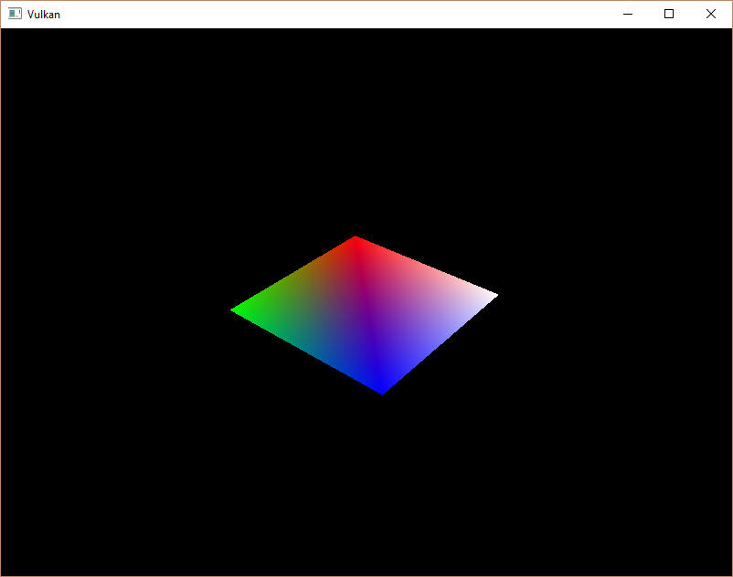

# Vulkan Tutorial 24 Descriptor pool and sets

## Introduction
描述符布局描述了前一章节讨论过的可以绑定的描述符的类型。在本章节，我们创建描述符集，
它将实际指定一个VkBuffer来绑定到一个uniform buffer描述符。

## Descriptor pool
描述符集合不能直接创建，它们必须像命令缓冲区一样，从对象池中分配使用。对于描述符集合相当于调用描述符对象池。
我们将写一个新的函数createDescriptorPool来配置。

<pre>
void initVulkan() {
    ...
    createUniformBuffer();
    createDescriptorPool();
    ...
}

...

void createDescriptorPool() {

}
</pre>

我们首先需要明确我们使用的描述符集合包含的描述符类型与数量，这里使用VkDescriptorPoolSize结构体。

<pre>
VkDescriptorPoolSize poolSize = {};
poolSize.type = VK_DESCRIPTOR_TYPE_UNIFORM_BUFFER;
poolSize.descriptorCount = 1;
</pre>

现在我们只有一个uniform buffer类型的单描述符。对象池大小将被VkDescriptorPoolCreateInfo结构体引用：

<pre>
VkDescriptorPoolCreateInfo poolInfo = {};
poolInfo.sType = VK_STRUCTURE_TYPE_DESCRIPTOR_POOL_CREATE_INFO;
poolInfo.poolSizeCount = 1;
poolInfo.pPoolSizes = &poolSize;
</pre>

我们也需要指定最大的描述符集合的分配数量：

poolInfo.maxSets = 1;  
该结构体与命令对象池类似，有一些可选项用于决定每个描述符集合是否可以独立管理生命周期：
VK_DESCRIPTOR_POOL_CREATE_FREE_DESCRIPTOR_SET_BIT。创建完毕后我们不会进一步使用它，
所以我们不需要该flag。在这里设置flags默认值为0。

<pre>
VkDescriptorPool descriptorPool;

...

if (vkCreateDescriptorPool(device, &poolInfo, nullptr, &descriptorPool) != VK_SUCCESS) {
    throw std::runtime_error("failed to create descriptor pool!");
}
</pre>

添加新的类成员对象保存描述符对象池的句柄，通过调用vkCreateDescriptorPool创建它。与其他绘制资源一样，
描述符对象池应该仅在程序退出的时候销毁：

<pre>
void cleanup() {
    cleanupSwapChain();

    vkDestroyDescriptorPool(device, descriptorPool, nullptr);

    ...
}
</pre>

## Descriptor set
为了从对象池中分配描述符集合，我们需要添加一个createDescriptorSet函数：

<pre>
void initVulkan() {
    ...
    createDescriptorPool();
    createDescriptorSet();
    ...
}

...

void createDescriptorSet() {

}
</pre>

描述符集合通过VkDescriptorSetAllocateInfo结构体描述具体的分配。需要指定用于分配的描述符对象池，分配的描述符集合数量，
以及基于此的描述符布局：

<pre>
VkDescriptorSetLayout layouts[] = {descriptorSetLayout};
VkDescriptorSetAllocateInfo allocInfo = {};
allocInfo.sType = VK_STRUCTURE_TYPE_DESCRIPTOR_SET_ALLOCATE_INFO;
allocInfo.descriptorPool = descriptorPool;
allocInfo.descriptorSetCount = 1;
allocInfo.pSetLayouts = layouts;
</pre>
添加类成员存储描述符集合的句柄，并使用vkAllocateDescriptorSets分配：

<pre>
VkDescriptorPool descriptorPool;
VkDescriptorSet descriptorSet;

...

if (vkAllocateDescriptorSets(device, &allocInfo, &descriptorSet) != VK_SUCCESS) {
    throw std::runtime_error("failed to allocate descriptor set!");
}
</pre>

我们不需要明确清理描述符集合，因为它们会在描述符对象池销毁的时候自动清理。
调用vkAllocateDescriptorSets会分配一个具有uniform buffer描述符的描述符集合。

描述符集合已经分配了，但是内部的描述符需要配置。描述符需要引用缓冲区，就像uniform buffer描述符，
使用VkDescriptorBufferInfo结构体进行配置。该结构体指定缓冲区和描述符内部包含的数据的区域：

<pre>
VkDescriptorBufferInfo bufferInfo = {};
bufferInfo.buffer = uniformBuffer;
bufferInfo.offset = 0;
bufferInfo.range = sizeof(UniformBufferObject);
</pre>

描述符的配置更新使用vkUpdateDescriptorSets函数，它需要VkWriteDescriptorSet结构体的数组作为参数。
<pre>
VkWriteDescriptorSet descriptorWrite = {};
descriptorWrite.sType = VK_STRUCTURE_TYPE_WRITE_DESCRIPTOR_SET;
descriptorWrite.dstSet = descriptorSet;
descriptorWrite.dstBinding = 0;
descriptorWrite.dstArrayElement = 0;
</pre>

前两个字段指定描述符集合更新和绑定的设置。我们为 uniform buffer 绑定的索引设定为0。
描述符可以是数组，所以我们需要指定要更新的数组索引。在这里没有使用数组，所以简单的设置为0。

descriptorWrite.descriptorType = VK_DESCRIPTOR_TYPE_UNIFORM_BUFFER;  
descriptorWrite.descriptorCount = 1;  
我们在这里再一次指定描述符类型。可以通过数组一次性更新多个描述符，使用dstArrayElement起始索引。
descriptorCount字段描述多少描述符需要被更新。

descriptorWrite.pBufferInfo = &bufferInfo;   
descriptorWrite.pImageInfo = nullptr; // Optional  
descriptorWrite.pTexelBufferView = nullptr; // Optional  

最后的字段引用descriptorCount结构体的数组，它配置了实际的描述符。
它的类型根据实际需要的三个描述符类型来设定。pBufferInfo字段用于指定描述符引用的缓冲区数据，
pImageInfo字段用于指定描述符引用的图像数据，描述符使用pTexelBufferView引用缓冲区视图。
我们的描述符是基于缓冲区的，所以我们使用pBufferInfo。

vkUpdateDescriptorSets(device, 1, &descriptorWrite, 0, nullptr);  
使用vkUpdateDescriptorSets应用实际的更新。它接受两种数组的参数：
一个数组是VkWriteDescriptorSet，另一个是VkCopyDescriptorSet。
后一个数组可以用于两个描述符之间进行拷贝操作。

##  Using a descriptor set
我们现在需要更新createCommandBuffers函数，使用cmdBindDescriptorSets将描述符集合绑定到实际的着色器的描述符中：

vkCmdBindDescriptorSets(commandBuffers[i], VK_PIPELINE_BIND_POINT_GRAPHICS, pipelineLayout, 0, 1, &descriptorSet, 0, nullptr);
与顶点和索引缓冲区不同，描述符集合不是图形管线唯一的。因此，我们需要指定是否要将描述符集绑定到图形或者计算管线。
下一个参数是描述符所基于的布局。接下来的三个参数指定首个描述符的索引，要绑定的集合的数量以及要绑定的集合的数组。
我们稍后回来。最后两个参数指定用于动态描述符的偏移数组。我们在后续的章节中会看到这些。

如果此时运行程序，会看不到任何内容在屏幕上。问题在于，由于我们在投影矩阵中进行了Y-flip操作，
所以顶点现在以顺时针顺序而不是逆时针顺序绘制。这导致背面剔除以防止任何背面的集合体被绘制。
来到createGraphicsPipeline函数，修改VkPipelineRasterizationStateCreateInfo结构体的frontFace如下：

rasterizer.cullMode = VK_CULL_MODE_BACK_BIT;  
rasterizer.frontFace = VK_FRONT_FACE_COUNTER_CLOCKWISE;  
运行程序如下：

 
 

矩形已经变为正方形，因为投影矩阵现在修正了宽高比。updateUniformData需要考虑屏幕的尺寸大小变化，
所以我们不需要重新创建描述符集合在recreateSwapChain中。

## Multiple descriptor sets
正如某些结构体和函数调用时候的提示所示，实际上可以绑定多个描述符集合。你需要在管线创建布局的时候为每个描述符集合指定描述符布局。
着色器可以引用具体的描述符集合如下：

layout(set = 0, binding = 0) uniform UniformBufferObject { ... }

我们可以使用此功能将每个对象和发生变化的描述符分配到单独的描述符集合中，
在这种情况下，可以避免重新绑定大部分描述符，而这些描述符可能会更有效率。

[代码](src/24.cpp)。
