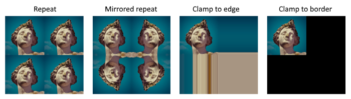
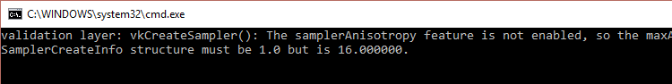

#Vulkan Tutorial 26 Image view and sampler

在本章节我们将为图形管线创建另外两个资源来对图像进行采样。第一个资源我们之前已经接触过了，就是交换链，
但是第二个资源比较新，它涉及着色器如何从图像中读取纹素。

## Texture image view
我们之前看过交换链和帧缓冲区，图像不是直接访问，而是通过图像视图。我们也会借助图像视图来访问纹理图像。

添加一个类成员变量vkImageView保存纹理图像，并且创建新的函数createTextureImageView：

<pre>
VkImageView textureImageView;

...

void initVulkan() {
    ...
    createTextureImage();
    createTextureImageView();
    createVertexBuffer();
    ...
}

...

void createTextureImageView() {

}
</pre>

函数中的代码可以主要基于createImageViews。仅有的两个变化是format和image字段：

<pre>
VkImageViewCreateInfo viewInfo = {};
viewInfo.sType = VK_STRUCTURE_TYPE_IMAGE_VIEW_CREATE_INFO;
viewInfo.image = textureImage;
viewInfo.viewType = VK_IMAGE_VIEW_TYPE_2D;
viewInfo.format = VK_FORMAT_R8G8B8A8_UNORM;
viewInfo.subresourceRange.aspectMask = VK_IMAGE_ASPECT_COLOR_BIT;
viewInfo.subresourceRange.baseMipLevel = 0;
viewInfo.subresourceRange.levelCount = 1;
viewInfo.subresourceRange.baseArrayLayer = 0;
viewInfo.subresourceRange.layerCount = 1;
</pre>

这里已经省略了显示的 viewInfo.components 初始化，因为VK_COMPONET_SWIZZLE_IDENTITY被定义为0。
最后在函数中通过调用vkCreateImageView完成图像视图的创建：

</pre>
if (vkCreateImageView(device, &viewInfo, nullptr, &textureImageView) != VK_SUCCESS) {
    throw std::runtime_error("failed to create texture image view!");
}
<pre>

因为很多逻辑都是从createImageViews复制过来的，所以可以抽象一个新的函数createImageView封装该部分逻辑。

<pre>
VkImageView createImageView(VkImage image, VkFormat format) {
    VkImageViewCreateInfo viewInfo = {};
    viewInfo.sType = VK_STRUCTURE_TYPE_IMAGE_VIEW_CREATE_INFO;
    viewInfo.image = image;
    viewInfo.viewType = VK_IMAGE_VIEW_TYPE_2D;
    viewInfo.format = format;
    viewInfo.subresourceRange.aspectMask = VK_IMAGE_ASPECT_COLOR_BIT;
    viewInfo.subresourceRange.baseMipLevel = 0;
    viewInfo.subresourceRange.levelCount = 1;
    viewInfo.subresourceRange.baseArrayLayer = 0;
    viewInfo.subresourceRange.layerCount = 1;

    VkImageView imageView;
    if (vkCreateImageView(device, &viewInfo, nullptr, &imageView) != VK_SUCCESS) {
        throw std::runtime_error("failed to create texture image view!");
    }

    return imageView;
}
</pre>

createTextureImageView函数可以简化为：

<pre>
void createTextureImageView() {
    textureImageView = createImageView(textureImage, VK_FORMAT_R8G8B8A8_UNORM);
}
</pre>
createImageViews可以简化为：

<pre>
void createImageViews() {
    swapChainImageViews.resize(swapChainImages.size());

    for (uint32_t i = 0; i < swapChainImages.size(); i++) {
        swapChainImageViews[i] = createImageView(swapChainImages[i], swapChainImageFormat);
    }
}
</pre>

确保程序退出的时候销毁图像视图，并在销毁图像本身前清理图像视图。

## Samplers
着色器直接从图像中读取纹素是可以的，但是当它们作为纹理图像的时候并不常见。纹理图像通常使用采样器来访问，应用过滤器和变换来计算最终的颜色。
这些过滤器有助于处理超载采样的问题。考虑一个映射到几何图形的纹理图像，拥有比纹素更多的片元。
如果只是在每个片段中使用最接近的纹理坐标，那么会获得第一个图像的结果：

如果混合最近的四个纹素通过显性插值，我们会看到更加平滑的结果，如右图所示。当然，应用程序可能具有符合左侧风格的艺术要求(比如Minecraft)，
但是常规的图形应用程序中更倾向右侧的效果。当从纹理中读取一个颜色的时候，采样器自动应用过滤器。

如果采样负载采样也会造成问题。当采样频率过高的时候，比如对于棋盘的纹理进行采样，会导致在有锐度角的地方产生幻影。

如作左侧图示，顺着距离的变化，纹理变的模糊且混乱的。解决方案是各向异性过滤 anisotropic filtering，它会自动被采样器应用。
除了这些过滤器，采样器也参与变换。当尝试读取图像外的纹素的时候，采用什么 addressing mode 寻址模式 。下图显示了一些可能的模式：

添加新函数createTextureSampler配置采样器对象。我们稍后会使用它从着色器中读取颜色。

<pre>
void initVulkan() {
    ...
    createTextureImage();
    createTextureImageView();
    createTextureSampler();
    ...
}

...

void createTextureSampler() {

}
</pre>

采样器通过VkSamplerCreateInfo结构体配置，它用来指定将要应用的过滤器和变换。
<pre>
VkSamplerCreateInfo samplerInfo = {};
samplerInfo.sType = VK_STRUCTURE_TYPE_SAMPLER_CREATE_INFO;
samplerInfo.magFilter = VK_FILTER_LINEAR;
samplerInfo.minFilter = VK_FILTER_LINEAR;
</pre>
magFilter 和 minFilter 过滤器字段指定纹素放大和缩小内插值方式。放大关注上文描述的超采样问题，
缩小关注负载采样的问题。VK_FILTER_NEAREST和VK_FILTER_LINEAR是可选的选项，对应上面图片纰漏的模式。

samplerInfo.addressModeU = VK_SAMPLER_ADDRESS_MODE_REPEAT;  
samplerInfo.addressModeV = VK_SAMPLER_ADDRESS_MODE_REPEAT;  
samplerInfo.addressModeW = VK_SAMPLER_ADDRESS_MODE_REPEAT;  
可以使用addressMode字段指定每个轴向使用的寻址模式。有效的值列在下方。大多数在图像中已经解释说明过了。
需要注意的是轴向在这里称为 U，V 和 W 代替 X，Y 和 Z。这是纹理空间坐标的约定。

* VK_SAMPLER_ADDRESS_MODE_REPEAT：当超过图像尺寸的时候采用循环填充。
* VK_SAMPLER_ADDRESS_MODE_MIRRORED_REPEAT：与循环模式类似，但是当超过图像尺寸的时候，它采用反向镜像效果。
* VK_SAMPLER_ADDRESS_MODE_CLAMP_TO_EDGE：当超过图像尺寸的时候，采用边缘最近的颜色进行填充。
* VK_SAMPLER_ADDRESS_MODE_MIRROR_CLAMP_TOEDGE：与边缘模式类似，但是使用与最近边缘相反的边缘进行填充。
* VK_SAMPLER_ADDRESS_MODE_CLAMP_TO_BORDER：当采样超过图像的尺寸时，返回一个纯色填充。

在这里使用什么样的寻址模式并不重要，因为我们不会在图像之外进行采样。但是循环模式是普遍使用的一种模式，
因为它可以用来实现诸如瓦片地面和墙面的纹理效果。

samplerInfo.anisotropyEnable = VK_TRUE;  
samplerInfo.maxAnisotropy = 16;  
这两个字段指定是否使用各向异性过滤器。没有理由不使用该特性，除非性能是一个问题。
maxAnisotropy字段限制可用于计算最终颜色的纹素采样的数量。低的数值会得到比较好的性能，但是会得到较差的质量。
当前没有任何的图形硬件可以使用超过16个采样器，因为与其超过16个采样器之间的差异可以忽略不计。

samplerInfo.borderColor = VK_BORDER_COLOR_INT_OPAQUE_BLACK;  
borderColor字段指定采样范围超过图像时候返回的颜色，与之对应的是边缘寻址模式。
可以以float或者int格式返回黑色，白色或者透明度。但是不能指定任意颜色。

samplerInfo.unnormalizedCoordinates = VK_FALSE;  
unnormalizedCoordinates字段指定使用的坐标系统，用于访问图像的纹素。
如果字段为VK_TRUE，意味着可以简单的使用坐标范围为 [ 0, texWidth ) 和 [ 0, texHeight )。
如果使用VK_FALSE，意味着每个轴向纹素访问使用  [ 0, 1) 范围。真实的应用程序总是使用归一化的坐标。
因为这样可以使用完全相同坐标的不同分辨率的纹理。

samplerInfo.compareEnable = VK_FALSE;  
samplerInfo.compareOp = VK_COMPARE_OP_ALWAYS;  
如果开启比较功能，那么纹素首先和值进行比较，并且比较后的值用于过滤操作。
主要用在阴影纹理映射的 percentage-closer filtering 即百分比近似过滤器。我们会在未来的章节中看到。

samplerInfo.mipmapMode = VK_SAMPLER_MIPMAP_MODE_LINEAR;  
samplerInfo.mipLodBias = 0.0f;  
samplerInfo.minLod = 0.0f;  
samplerInfo.maxLod = 0.0f;  
所有这些字段应用在mipmapping。mipmapping也在未来章节中看到，但是基本的它可以应用另一种滤波器。

采样器的功能现在已经完整的定义了。添加类成员持有采样器对象的引用并通过vkCreateSampler创建采样器：

<pre>
VkImageView textureImageView;
VkSampler textureSampler;

...

void createTextureSampler() {
    ...

    if (vkCreateSampler(device, &samplerInfo, nullptr, &textureSampler) != VK_SUCCESS) {
        throw std::runtime_error("failed to create texture sampler!");
    }
}
</pre>

需要注意的是采样器没有任何地方引用VkImage。采样器是一个独特的对象，它提供了从纹理中提取颜色的接口。
它可以应用在任何你期望的图像中，无论是1D，2D，或者是3D。也与之前很多旧的API是不同的，后者将纹理图像与过滤器混合成单一状态。

在程序的最后且不再访问图像的时候，销毁采样器：

<pre>
void cleanup() {
    cleanupSwapChain();

    vkDestroySampler(device, textureSampler, nullptr);
    vkDestroyImageView(device, textureImageView, nullptr);

    ...
}
</pre>

## Anisotropy device feature
如果现在运行程序，你会看到validation layer消息如下：

这是因为各向异性滤波器是一个可选的特性。我们需要更新createLogicalDevice函数请求它：

VkPhysicalDeviceFeatures deviceFeatures = {};  
deviceFeatures.samplerAnisotropy = VK_TRUE;  
并且尽管现在的图形卡不太可能不支持该功能，但建议仍然更新isDeviceSuitable函数去检测是否有效：

<pre>
bool isDeviceSuitable(VkPhysicalDevice device) {
    ...

    VkPhysicalDeviceFeatures supportedFeatures;
    vkGetPhysicalDeviceFeatures(device, &supportedFeatures);

    return indices.isComplete() && extensionsSupported && supportedFeatures.samplerAnisotropy;
}
</pre>

vkGetPhysicalDeviceFeatures将VkPhysicalDeviceFeatures结构重新定义，指定哪些特性被支持而不是通过设置boolean值来请求。

如果不是强制使用各向异性滤波器，也可以简单的通过条件设定来不使用它：

samplerInfo.anisotropyEnable = VK_FALSE;  
samplerInfo.maxAnisotropy = 1;  
下一章我们将图像与采样器对象公开到着色器中，绘制纹理到正方形上。

[代码](src/26.cpp)。

