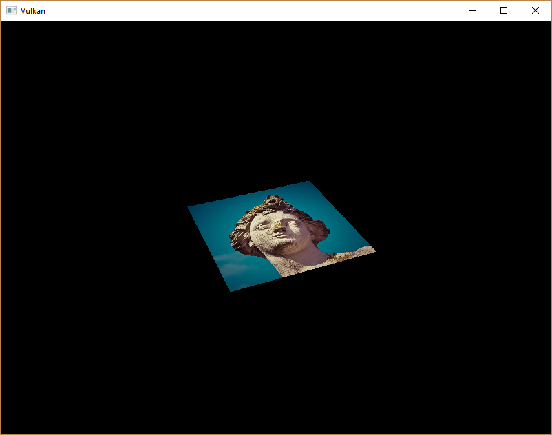

# Vulkan Tutorial 27 Combined image sampler 

## Introduction
我们在教程的 uniform buffer 章节中首次了解了描述符。在本章节我们会看到一种新的描述符类型：
combined image sampler 组合图像取样器。该描述符使着色器通过类似上一章创建的采样器对象那样，来访问图像资源。

我们将首先修改描述符布局，描述符对象池和描述符集合，以包括这样一个组合的图像采样器描述符。
完成之后，我们会添加纹理贴图坐标到Vertex数据中，并修改片段着色器从纹理中读取颜色，而不是内插顶点颜色。

## Updating the descriptors
浏览到createDesriptorSetLayout函数，并为组合图像采样器描述符添加一个VkDescriptorSetLayoutBinding。
我们将简单的在uniform buffer之后进行绑定操作。

<pre>
VkDescriptorSetLayoutBinding samplerLayoutBinding = {};
samplerLayoutBinding.binding = 1;
samplerLayoutBinding.descriptorCount = 1;
samplerLayoutBinding.descriptorType = VK_DESCRIPTOR_TYPE_COMBINED_IMAGE_SAMPLER;
samplerLayoutBinding.pImmutableSamplers = nullptr;
samplerLayoutBinding.stageFlags = VK_SHADER_STAGE_FRAGMENT_BIT;

std::array<VkDescriptorSetLayoutBinding, 2> bindings = {uboLayoutBinding, samplerLayoutBinding};
VkDescriptorSetLayoutCreateInfo layoutInfo = {};
layoutInfo.sType = VK_STRUCTURE_TYPE_DESCRIPTOR_SET_LAYOUT_CREATE_INFO;
layoutInfo.bindingCount = static_cast<uint32_t>(bindings.size());
layoutInfo.pBindings = bindings.data();
</pre>

确保stageFlags正确设置，指定我们打算在片段着色器中使用组合图像采样器描述符。这就是片段颜色最终被确定的地方。
可以在顶点着色器中使用纹理采样，比如，通过高度图 heightmap 动态的变形顶点的网格。

如果你开启validation layers运行程序，你将会看到它引起了描述符对象池不能使用这个布局分配描述符集合，
因为它没有任何组合图像采样器描述符。来到createDescriptorPool函数，以包含此描述符的VkDescriptorPoolSize：

<pre>
std::array<VkDescriptorPoolSize, 2> poolSizes = {};
poolSizes[0].type = VK_DESCRIPTOR_TYPE_UNIFORM_BUFFER;
poolSizes[0].descriptorCount = 1;
poolSizes[1].type = VK_DESCRIPTOR_TYPE_COMBINED_IMAGE_SAMPLER;
poolSizes[1].descriptorCount = 1;

VkDescriptorPoolCreateInfo poolInfo = {};
poolInfo.sType = VK_STRUCTURE_TYPE_DESCRIPTOR_POOL_CREATE_INFO;
poolInfo.poolSizeCount = static_cast<uint32_t>(poolSizes.size());
poolInfo.pPoolSizes = poolSizes.data();
poolInfo.maxSets = 1;
</pre>

最后一步是将实际的图像和采样器资源绑定到描述符集合中的具体描述符。来到createDescriptorSet函数。

<pre>
VkDescriptorImageInfo imageInfo = {};
imageInfo.imageLayout = VK_IMAGE_LAYOUT_SHADER_READ_ONLY_OPTIMAL;
imageInfo.imageView = textureImageView;
imageInfo.sampler = textureSampler;
</pre>
组合图像采样器结构体的资源必须在VkDescriptorImageInfo结构进行指定。
就像在VkDescriptorBufferInfo结构体中指定一个 uniform buffer descriptor 缓冲区资源一样。这是上一章节中的对象汇集的代码段。

<pre>
std::array<VkWriteDescriptorSet, 2> descriptorWrites = {};

descriptorWrites[0].sType = VK_STRUCTURE_TYPE_WRITE_DESCRIPTOR_SET;
descriptorWrites[0].dstSet = descriptorSet;
descriptorWrites[0].dstBinding = 0;
descriptorWrites[0].dstArrayElement = 0;
descriptorWrites[0].descriptorType = VK_DESCRIPTOR_TYPE_UNIFORM_BUFFER;
descriptorWrites[0].descriptorCount = 1;
descriptorWrites[0].pBufferInfo = &bufferInfo;

descriptorWrites[1].sType = VK_STRUCTURE_TYPE_WRITE_DESCRIPTOR_SET;
descriptorWrites[1].dstSet = descriptorSet;
descriptorWrites[1].dstBinding = 1;
descriptorWrites[1].dstArrayElement = 0;
descriptorWrites[1].descriptorType = VK_DESCRIPTOR_TYPE_COMBINED_IMAGE_SAMPLER;
descriptorWrites[1].descriptorCount = 1;
descriptorWrites[1].pImageInfo = &imageInfo;

vkUpdateDescriptorSets(device, static_cast<uint32_t>(descriptorWrites.size()), descriptorWrites.data(), 0, nullptr);
</pre>

描述符必须与此图像信息一起更新，就像缓冲区一样。这次我们使用pImageInfo数组代替pBufferInfo。描述符现在可以被着色器使用！

## Texture coordinates
纹理映射的一个重要组成部分仍然缺少，这是每个顶点的实际坐标。坐标决定如何实际的映射到几何图形上。

<pre>
struct Vertex {
    glm::vec2 pos;
    glm::vec3 color;
    glm::vec2 texCoord;

    static VkVertexInputBindingDescription getBindingDescription() {
        VkVertexInputBindingDescription bindingDescription = {};
        bindingDescription.binding = 0;
        bindingDescription.stride = sizeof(Vertex);
        bindingDescription.inputRate = VK_VERTEX_INPUT_RATE_VERTEX;

        return bindingDescription;
    }

    static std::array<VkVertexInputAttributeDescription, 3> getAttributeDescriptions() {
        std::array<VkVertexInputAttributeDescription, 3> attributeDescriptions = {};

        attributeDescriptions[0].binding = 0;
        attributeDescriptions[0].location = 0;
        attributeDescriptions[0].format = VK_FORMAT_R32G32_SFLOAT;
        attributeDescriptions[0].offset = offsetof(Vertex, pos);

        attributeDescriptions[1].binding = 0;
        attributeDescriptions[1].location = 1;
        attributeDescriptions[1].format = VK_FORMAT_R32G32B32_SFLOAT;
        attributeDescriptions[1].offset = offsetof(Vertex, color);

        attributeDescriptions[2].binding = 0;
        attributeDescriptions[2].location = 2;
        attributeDescriptions[2].format = VK_FORMAT_R32G32_SFLOAT;
        attributeDescriptions[2].offset = offsetof(Vertex, texCoord);

        return attributeDescriptions;
    }
};
</pre>

修改Vertex结构体包含vec2结构用于纹理坐标。确保加入VkVertexInputAttributeDescription结构体，
如此我们就可以在顶点着色器中访问纹理UV坐标数据。这是必要的，以便能够将它们传递到片段着色器，以便在正方形的表面进行插值处理。

<pre>
const std::vector<Vertex> vertices = {
    {{-0.5f, -0.5f}, {1.0f, 0.0f, 0.0f}, {1.0f, 0.0f}},
    {{0.5f, -0.5f}, {0.0f, 1.0f, 0.0f}, {0.0f, 0.0f}},
    {{0.5f, 0.5f}, {0.0f, 0.0f, 1.0f}, {0.0f, 1.0f}},
    {{-0.5f, 0.5f}, {1.0f, 1.0f, 1.0f}, {1.0f, 1.0f}}
};
</pre>

在本教程中，使用坐标从左上角 0，0 到右下角的 1，1 来映射纹理，从而简单的填充矩形。在这里可以尝试各种坐标。
尝试使用低于 0 或者 1 以上的坐标来查看寻址模式的不同表现。

## Shaders
最后一步是修改着色器从纹理中采样颜色。我们首先需要修改顶点着色器，传递纹理坐标到片段着色器。
<pre>
layout(location = 0) in vec2 inPosition;
layout(location = 1) in vec3 inColor;
layout(location = 2) in vec2 inTexCoord;

layout(location = 0) out vec3 fragColor;
layout(location = 1) out vec2 fragTexCoord;

void main() {
    gl_Position = ubo.proj * ubo.view * ubo.model * vec4(inPosition, 0.0, 1.0);
    fragColor = inColor;
    fragTexCoord = inTexCoord;
}
</pre>

就像每个顶点的颜色，fragTexCoord值通过光栅化平滑的插值到矩形区域内。我们可以通过使片段着色器输出的纹理坐标为颜色来可视化看到这些：

<pre>
#version 450
#extension GL_ARB_separate_shader_objects : enable

layout(location = 0) in vec3 fragColor;
layout(location = 1) in vec2 fragTexCoord;

layout(location = 0) out vec4 outColor;

void main() {
    outColor = vec4(fragTexCoord, 0.0, 1.0);
}
</pre>

现在应该可以看到如下图所示的效果。不要忘记重新编译着色器！

 

绿色通道代表水平坐标，红色通道代表垂直坐标。黑色和黄色角确认了纹理坐标正确的从 0，0 到 1，1 进行插值填充到方形中。
使用颜色可视化在着色器中编程等价于 printf 调试，除此之外没有更好的方法！

组合图像采样器描述符在GLSL中通过采样器 uniform代替。在片段着色器中引用它：

layout(binding = 1) uniform sampler2D texSampler;
对于其他图像有等价的 sampler1D 和 sampler3D 类型。确保正确的绑定操作。

void main() {
    outColor = texture(texSampler, fragTexCoord);
}

纹理采用内置的 texture 函数进行采样。它需要使用 sampler 和 坐标作为参数。采样器在后台自动处理过滤和变化功能。
你应该可以看到纹理贴图在方形上：

 

尝试修改寻址模式放大大于 1 来观测效果。比如，下面的片段着色器输出的结果使用VK_SAMPLER_ADDRESS_MODE_REPEAT：

<pre>
void main() {
    outColor = texture(texSampler, fragTexCoord * 2.0);
}
</pre>

 

还可以使用顶点颜色来处理纹理颜色：

<pre>
void main() {
    outColor = vec4(fragColor * texture(texSampler, fragTexCoord).rgb, 1.0);
}
</pre>

将RGB和alha通道分离开，以便不缩放alpha通道。

 

现在已经知道如何在着色器中访问图像！当与帧缓冲区中的图像进行结合时，这是一个非常有效的技术。
你可以看到这些图像作为输入实现很酷的效果，比如 post-processing和3D世界摄像机显示。

[代码](src/27.cpp)。
