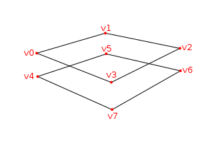

#Vulkan Tutorial 28 Depth buffering

## Introduction
到目前为止，我们所使用的几何图形为3D，但仍然完全扁平的。在本章节中我们添加Z坐标到3D模型数据中。
我们将使用这个第三个坐标在当前平面上放置一个正方形，以查看几何图形没有进行深度排序造成的问题。

## 3D geometry
修改 Vertex 结构体使用3D vector作为位置，并且更新对应VkVertexInputAttributeDescription的 format。

<pre>
struct Vertex {
    glm::vec3 pos;
    glm::vec3 color;
    glm::vec2 texCoord;

    ...

    static std::array<VkVertexInputAttributeDescription, 3> getAttributeDescriptions() {
        std::array<VkVertexInputAttributeDescription, 3> attributeDescriptions = {};

        attributeDescriptions[0].binding = 0;
        attributeDescriptions[0].location = 0;
        attributeDescriptions[0].format = VK_FORMAT_R32G32B32_SFLOAT;
        attributeDescriptions[0].offset = offsetof(Vertex, pos);

        ...
    }
};
</pre>

下一步更新顶点着色器接受和转换3D坐标作为输入。别忘记重新编译它！

<pre>
layout(location = 0) in vec3 inPosition;

...

void main() {
    gl_Position = ubo.proj * ubo.view * ubo.model * vec4(inPosition, 1.0);
    fragColor = inColor;
    fragTexCoord = inTexCoord;
}
</pre>

最后，更新 vertices 容器包含 Z 坐标：

<pre>
const std::vector<Vertex> vertices = {
    {{-0.5f, -0.5f, 0.0f}, {1.0f, 0.0f, 0.0f}, {0.0f, 0.0f}},
    {{0.5f, -0.5f, 0.0f}, {0.0f, 1.0f, 0.0f}, {1.0f, 0.0f}},
    {{0.5f, 0.5f, 0.0f}, {0.0f, 0.0f, 1.0f}, {1.0f, 1.0f}},
    {{-0.5f, 0.5f, 0.0f}, {1.0f, 1.0f, 1.0f}, {0.0f, 1.0f}}
};
</pre>

如果运行程序，会看到与之前同样的结果。现在是时候添加一些额外的几何图形，使场景更有趣，并展示我们将在本章节中解决的问题。
复制顶点以定义当前正方形的位置，如下所示：

 

使用Z坐标 -0.5f 并且为额外的方形添加适当的索引：

<pre>
const std::vector<Vertex> vertices = {
    {{-0.5f, -0.5f, 0.0f}, {1.0f, 0.0f, 0.0f}, {0.0f, 0.0f}},
    {{0.5f, -0.5f, 0.0f}, {0.0f, 1.0f, 0.0f}, {1.0f, 0.0f}},
    {{0.5f, 0.5f, 0.0f}, {0.0f, 0.0f, 1.0f}, {1.0f, 1.0f}},
    {{-0.5f, 0.5f, 0.0f}, {1.0f, 1.0f, 1.0f}, {0.0f, 1.0f}},

    {{-0.5f, -0.5f, -0.5f}, {1.0f, 0.0f, 0.0f}, {0.0f, 0.0f}},
    {{0.5f, -0.5f, -0.5f}, {0.0f, 1.0f, 0.0f}, {1.0f, 0.0f}},
    {{0.5f, 0.5f, -0.5f}, {0.0f, 0.0f, 1.0f}, {1.0f, 1.0f}},
    {{-0.5f, 0.5f, -0.5f}, {1.0f, 1.0f, 1.0f}, {0.0f, 1.0f}}
};

const std::vector<uint16_t> indices = {
    0, 1, 2, 2, 3, 0,
    4, 5, 6, 6, 7, 4
};
</pre>

运行程序现在会看到类似于Escher的例子：

 

问题是，下方正方形的片段被绘制在上方的片段上，这仅仅是因为它在索引数组中。有两种方式解决这种问题：
* 从后面到前面深入分析所有的绘图调用
* 使用深度缓冲区进行深度测试

第一种方法通常用于绘制透明对象，因为与顺序无关的透明度是难以解决的难题。
然而，通过深度排序片段的问题通常使用深度缓冲区 depth buffer 来解决。
深度缓冲区是一个额外的附件，用于存储每个顶点的深度信息，就像颜色附件存储每个位置的颜色信息一样。
每次光栅化生成片段时，深度测试将检查新片段是否比上一个片段更近。
如果没有，新的片段被丢弃。一个片段将深度测试的值写入深度缓冲区。可以从片段着色器处理此值，就像可以操作颜色输出一样。

<pre>
#define GLM_FORCE_RADIANS
#define GLM_FORCE_DEPTH_ZERO_TO_ONE
#include <glm/glm.hpp>
#include <glm/gtc/matrix_transform.hpp>
</pre>

借助GLM生产出的透视投影矩阵默认使用OpenGL的深度范围，收敛在 -1.0 到 1.0。
我们需要使用GLM_FORCE_DEPTH_ZERO_TO_ONE定义将其配置为使用 0.0 到 1.0 的Vulkan深度范围。

## Depth image and view
深度附件是基于图像的，就像颜色附件。所不同的是交换链不会自动创建深度图像。我们仅需要一个深度图像，因为每次只有一个绘制操作。
深度图像再次需要申请三种资源：图像，内存和图像视图。

<pre>
VkImage depthImage;
VkDeviceMemory depthImageMemory;
VkImageView depthImageView;
创建createDepthResources函数来配置资源：

void initVulkan() {
    ...
    createCommandPool();
    createDepthResources();
    createTextureImage();
    ...
}

...

void createDepthResources() {

}
</pre>

创建深度图像非常直接。它具备与颜色附件同样的分辨率，定义交换链尺寸，合理的深度图像是否方式，最佳的平铺和设备本地内存。
唯一的问题是：对于深度图像什么是正确的格式？format必须包含深度原件，诸如 VK_FORMAT 中的 _D??_。

不像纹理贴图，我们不一定需要特定的格式，因为我们不会直接从程序中访问纹素。它仅仅需要一个合理的准确性，
至少24位在实际程序中是常见的。有几种符合要求的格式：

* VK_FORMAT_D32_SFLOAT: 32-bit float depth
* VK_FORMAT_D32_SFLOAT_S8_UNIT: 32-bit signed float depth 和 8-bit stencil component
* VK_FORMAT_D32_UNORM_S8_UINT: 24-bit float depth 和 8-bit stencil component
stencil component 模版组件用于模版测试 stencil tests，这是可以与深度测试组合的附加测试。我们将在未来的章节中展开。

我们可以简化为 VK_FORMAT_D32_SFLOAT 格式，因为它的支持是非常常见的，但是尽可能的添加一些额外的灵活性也是很好的。
我们增加一个函数 findSupportedFormat 从候选格式列表中 根据期望值的降序原则，检测第一个得到支持的格式。

<pre>
VkFormat findSupportedFormat(const std::vector<VkFormat>& candidates, VkImageTiling tiling, VkFormatFeatureFlags features) {

}
</pre>

支持的格式依赖于所使用的 tiling mode平铺模式和具体的用法，所以我们必须包含这些参数。
可以使用 vkGetPhysicalDeviceFormatProperties 函数查询格式的支持：

<pre>
for (VkFormat format : candidates) {
    VkFormatProperties props;
    vkGetPhysicalDeviceFormatProperties(physicalDevice, format, &props);
}
</pre>

VkFormatProperties 结构体包含三个字段：
* linearTilingFeatures: 使用线性平铺格式
* optimalTilingFeatures: 使用最佳平铺格式
* bufferFeatures: 支持缓冲区

只有前两个在这里是相关的，我们检查取决于函数的 tiling 平铺参数。

<pre>
if (tiling == VK_IMAGE_TILING_LINEAR && (props.linearTilingFeatures & features) == features) {
    return format;
} else if (tiling == VK_IMAGE_TILING_OPTIMAL && (props.optimalTilingFeatures & features) == features) {
    return format;
}
</pre>

如果没有任何期望的格式得到支持，我们可以指定一个特殊的值或者抛出异常：

<pre>
VkFormat findSupportedFormat(const std::vector<VkFormat>& candidates, VkImageTiling tiling, VkFormatFeatureFlags features) {
    for (VkFormat format : candidates) {
        VkFormatProperties props;
        vkGetPhysicalDeviceFormatProperties(physicalDevice, format, &props);

        if (tiling == VK_IMAGE_TILING_LINEAR && (props.linearTilingFeatures & features) == features) {
            return format;
        } else if (tiling == VK_IMAGE_TILING_OPTIMAL && (props.optimalTilingFeatures & features) == features) {
            return format;
        }
    }

    throw std::runtime_error("failed to find supported format!");
}
</pre>

我们添加 findDepthFormat 辅助函数， 以选择具有深度组件的格式，该深度组件支持使用深度附件：

<pre>
VkFormat findDepthFormat() {
    return findSupportedFormat(
        {VK_FORMAT_D32_SFLOAT, VK_FORMAT_D32_SFLOAT_S8_UINT, VK_FORMAT_D24_UNORM_S8_UINT},
        VK_IMAGE_TILING_OPTIMAL,
        VK_FORMAT_FEATURE_DEPTH_STENCIL_ATTACHMENT_BIT
    );
}
</pre>

确保使用 VK_FORMAT_FEATURE_ 标志代替 VK_IMAGE_USAGE_ 。所有的候选格式都包含深度组件，但是最后两个也包含 stencil 组件。
我们不会使用它，但是我们需要考虑到这一点，比如在这些格式的图像布局进行变换的时候。添加一个简单的辅助函数，
告诉我们所选择的深度格式是否包含模版组件：

<pre>
bool hasStencilComponent(VkFormat format) {
    return format == VK_FORMAT_D32_SFLOAT_S8_UINT || format == VK_FORMAT_D24_UNORM_S8_UINT;
}
</pre>

调用函数从 createDepthResources 找到深度格式：

VkFormat depthFormat = findDepthFormat();  
我们现在拥有所有必须的信息来调用我们的 createImage 和 createImageView 辅助函数：

<pre>
createImage(swapChainExtent.width, swapChainExtent.height, depthFormat, VK_IMAGE_TILING_OPTIMAL, VK_IMAGE_USAGE_DEPTH_STENCIL_ATTACHMENT_BIT, VK_MEMORY_PROPERTY_DEVICE_LOCAL_BIT, depthImage, depthImageMemory);
depthImageView = createImageView(depthImage, depthFormat);
</pre>
然而，createImageView 函数现在假定子资源始终为 VK_IMAGE_ASPECT_COLOR_BIT, 因此我们需要将该字段转换为参数：

<pre>
VkImageView createImageView(VkImage image, VkFormat format, VkImageAspectFlags aspectFlags) {
    ...
    viewInfo.subresourceRange.aspectMask = aspectFlags;
    ...
}
</pre>

更新对此函数的所有调用，确保正确无误：

<pre>
swapChainImageViews[i] = createImageView(swapChainImages[i], swapChainImageFormat, VK_IMAGE_ASPECT_COLOR_BIT);
...
depthImageView = createImageView(depthImage, depthFormat, VK_IMAGE_ASPECT_DEPTH_BIT);
...
textureImageView = createImageView(textureImage, VK_FORMAT_R8G8B8A8_UNORM, VK_IMAGE_ASPECT_COLOR_BIT);
</pre>

这就是创建深度图像。我们不需要映射它或者拷贝另一个图像，因为我们会在渲染通道开始的时候进行清理，就像颜色附件那样。
然而，它仍然需要变换为合适的深度附件使用的布局。我们可以在渲染通道中像颜色附件那样做，
但是在这里我们选择使用管线屏障，因为变换只会发生一次。

transitionImageLayout(depthImage, depthFormat, VK_IMAGE_LAYOUT_UNDEFINED, VK_IMAGE_LAYOUT_DEPTH_STENCIL_ATTACHMENT_OPTIMAL);  
未定义的布局可以作为初始布局，因为深度图像内容无关紧要。我们需要在 transitionImageLayout 中更新一些逻辑使用正确的子资源：

<pre>
if (newLayout == VK_IMAGE_LAYOUT_DEPTH_STENCIL_ATTACHMENT_OPTIMAL) {
    barrier.subresourceRange.aspectMask = VK_IMAGE_ASPECT_DEPTH_BIT;

    if (hasStencilComponent(format)) {
        barrier.subresourceRange.aspectMask |= VK_IMAGE_ASPECT_STENCIL_BIT;
    }
} else {
    barrier.subresourceRange.aspectMask = VK_IMAGE_ASPECT_COLOR_BIT;
}
</pre>

尽管我们不会使用模版组件，我们确实需要将其包含在深度图像的布局变换中。

最后，添加正确的访问掩码和管线阶段：

<pre>
if (oldLayout == VK_IMAGE_LAYOUT_UNDEFINED && newLayout == VK_IMAGE_LAYOUT_TRANSFER_DST_OPTIMAL) {
    barrier.srcAccessMask = 0;
    barrier.dstAccessMask = VK_ACCESS_TRANSFER_WRITE_BIT;

    sourceStage = VK_PIPELINE_STAGE_TOP_OF_PIPE_BIT;
    destinationStage = VK_PIPELINE_STAGE_TRANSFER_BIT;
} else if (oldLayout == VK_IMAGE_LAYOUT_TRANSFER_DST_OPTIMAL && newLayout == VK_IMAGE_LAYOUT_SHADER_READ_ONLY_OPTIMAL) {
    barrier.srcAccessMask = VK_ACCESS_TRANSFER_WRITE_BIT;
    barrier.dstAccessMask = VK_ACCESS_SHADER_READ_BIT;

    sourceStage = VK_PIPELINE_STAGE_TRANSFER_BIT;
    destinationStage = VK_PIPELINE_STAGE_FRAGMENT_SHADER_BIT;
} else if (oldLayout == VK_IMAGE_LAYOUT_UNDEFINED && newLayout == VK_IMAGE_LAYOUT_DEPTH_STENCIL_ATTACHMENT_OPTIMAL) {
    barrier.srcAccessMask = 0;
    barrier.dstAccessMask = VK_ACCESS_DEPTH_STENCIL_ATTACHMENT_READ_BIT | VK_ACCESS_DEPTH_STENCIL_ATTACHMENT_WRITE_BIT;

    sourceStage = VK_PIPELINE_STAGE_TOP_OF_PIPE_BIT;
    destinationStage = VK_PIPELINE_STAGE_EARLY_FRAGMENT_TESTS_BIT;
} else {
    throw std::invalid_argument("unsupported layout transition!");
}
</pre>

读取深度缓冲区并执行深度测试，以确认当前片段是否可见，并将在绘制新片段时更新深度缓冲区。
读取操作发生在 VK_PIPELINE_STAGE_EARLY_FRAGMENT_TESTS_BIT 阶段，
并在 VK_PIPELINE_STAGE_LATE_FRAGMETN_TESTS_BIT 中进行写入操作。
我们应该选择与指定操作相匹配的最早的管线阶段，以便在需要时可以作为深度附件使用。

##  Render pass
现在修改 createRenderPass 函数包含深度附件。首先指定 VkAttachmentDescription。

<pre>
VkAttachmentDescription depthAttachment = {};
depthAttachment.format = findDepthFormat();
depthAttachment.samples = VK_SAMPLE_COUNT_1_BIT;
depthAttachment.loadOp = VK_ATTACHMENT_LOAD_OP_CLEAR;
depthAttachment.storeOp = VK_ATTACHMENT_STORE_OP_DONT_CARE;
depthAttachment.stencilLoadOp = VK_ATTACHMENT_LOAD_OP_DONT_CARE;
depthAttachment.stencilStoreOp = VK_ATTACHMENT_STORE_OP_DONT_CARE;
depthAttachment.initialLayout = VK_IMAGE_LAYOUT_UNDEFINED;
depthAttachment.finalLayout = VK_IMAGE_LAYOUT_DEPTH_STENCIL_ATTACHMENT_OPTIMAL;
</pre>

format 应该与深度图像一致。这次我们不会关心存储深度数据(storeOp)，因为绘制完成后它不会在被使用。
这可能允许硬件执行其他的优化。就像颜色缓冲区一样，我们不关心之前的深度内容，
所以我们可以使用 VK_IMAGE_LAYOUT_UNDEFINED作为 initialLayout。

<pre>
VkAttachmentReference depthAttachmentRef = {};
depthAttachmentRef.attachment = 1;
depthAttachmentRef.layout = VK_IMAGE_LAYOUT_DEPTH_STENCIL_ATTACHMENT_OPTIMAL;
</pre>

添加第一个(唯一的)子通道的附件引用：

<pre>
VkSubpassDescription subpass = {};
subpass.pipelineBindPoint = VK_PIPELINE_BIND_POINT_GRAPHICS;
subpass.colorAttachmentCount = 1;
subpass.pColorAttachments = &colorAttachmentRef;
subpass.pDepthStencilAttachment = &depthAttachmentRef;
</pre>

与颜色附件不同的是，子通道仅仅使用一个深度 (模版) 附件。对多个缓冲区进行深度测试并没有任何意义。

<pre>
std::array<VkAttachmentDescription, 2> attachments = {colorAttachment, depthAttachment};
VkRenderPassCreateInfo renderPassInfo = {};
renderPassInfo.sType = VK_STRUCTURE_TYPE_RENDER_PASS_CREATE_INFO;
renderPassInfo.attachmentCount = static_cast<uint32_t>(attachments.size());
renderPassInfo.pAttachments = attachments.data();
renderPassInfo.subpassCount = 1;
renderPassInfo.pSubpasses = &subpass;
renderPassInfo.dependencyCount = 1;
renderPassInfo.pDependencies = &dependency;
</pre>

最后更新 VkRenderPassCreateInfo 结构体引用两个附件。

## Framebuffer
下一步修改帧缓冲区的创建以及将深度图像绑定到深度附件。来到 createFramebuffers 函数，并指定深度图像视图为第二个附件：

<pre>
std::array<VkImageView, 2> attachments = {
    swapChainImageViews[i],
    depthImageView
};

VkFramebufferCreateInfo framebufferInfo = {};
framebufferInfo.sType = VK_STRUCTURE_TYPE_FRAMEBUFFER_CREATE_INFO;
framebufferInfo.renderPass = renderPass;
framebufferInfo.attachmentCount = static_cast<uint32_t>(attachments.size());
framebufferInfo.pAttachments = attachments.data();
framebufferInfo.width = swapChainExtent.width;
framebufferInfo.height = swapChainExtent.height;
framebufferInfo.layers = 1;
</pre>

每个交换链图像的颜色附件不同，但是所有这些都是使用相同的深度图像，由于我们的信号量，同一时间只有一个渲染通道执行。

我们需要移动 createFramebuffers 函数的调用位置，以确保在深度图像视图实际创建后调用。

<pre>
void initVulkan() {
    ...
    createDepthResources();
    createFramebuffers();
    ...
}
</pre>

## Clear values
因为我们现在有多个带 VK_ATTACHMENT_LOAD_OP_CLEAR 的附件，我们还需要指定多个清除值。
来到 createCommandBuffers 并创建一个 VkClearValue 结构体的数组：

<pre>
std::array<VkClearValue, 2> clearValues = {};
clearValues[0].color = {0.0f, 0.0f, 0.0f, 1.0f};
clearValues[1].depthStencil = {1.0f, 0};

renderPassInfo.clearValueCount = static_cast<uint32_t>(clearValues.size());
renderPassInfo.pClearValues = clearValues.data();
</pre>
在Vulkan中深度缓冲区的数值范围在 0.0 到 1.0 之间。其中 1.0 位于远视图平面，在近视图平面处为 0.0。
深度缓冲区的每个点的初始值为最深的可能的深度值，即 1.0。

## Depth and stencil state
深度附件现在已经准备好，但是深度测试仍然需要在图形管线开启。它通过 VkPipelineDepthStencilStateCreateInfo 结构体配置：

<pre>
VkPipelineDepthStencilStateCreateInfo depthStencil = {};
depthStencil.sType = VK_STRUCTURE_TYPE_PIPELINE_DEPTH_STENCIL_STATE_CREATE_INFO;
depthStencil.depthTestEnable = VK_TRUE;
depthStencil.depthWriteEnable = VK_TRUE;
</pre>
depthTestEnable 字段指定是否应该将新的深度缓冲区与深度缓冲区进行比较，以确认是否应该被丢弃。
depthWriteEnable 字段指定通过深度测试的新的片段深度是否应该被实际写入深度缓冲区。这在绘制透明对象的时候非常有用。
它们应该与之前渲染的不透明对象进行比较，但不会导致更远的透明对象不被绘制。

depthStencil.depthCompareOp = VK_COMPARE_OP_LESS;  
depthCompareOp 字段指定执行保留或者丢弃片段的比较细节。我们坚持深度值较低的惯例，它意味着更近。所以新的片段的深度应该更小。

depthStencil.depthBoundsTestEnable = VK_FALSE;  
depthStencil.minDepthBounds = 0.0f; // Optional  
depthStencil.maxDepthBounds = 1.0f; // Optional  
 depthBoundsTestEnable, minDepthBounds 和 maxDepthBounds 字段用于可选择的优化深度绑定测试。
 基本上，这允许只保留落在指定深度范围内的片元。我们不会使用该功能。

depthStencil.stencilTestEnable = VK_FALSE;  
depthStencil.front = {}; // Optional  
depthStencil.back = {}; // Optional  
最后三个字段用于配置模版缓冲区的操作，同样的，在本系列教程中我们也不会使用该功能。如果想使用该功能，
要确保 depth/stencil 图像的格式包含模版原件。

pipelineInfo.pDepthStencilState = &depthStencil;  
更新 VkGraphicsPipelineCreateInfo 结构体引用更深度模版状态。如果渲染通道包含深度模版附件，则必须指定深度模版状态。

运行程序，应该可以看到几何图形的片元按照正确的方式排列顺序。

 

## Handling window resize
当窗口调整大小以匹配新的颜色附件分辨率时，深度缓冲区的分辨率应该进行变化。在这种情况下，扩展 rebuildSwapChain 函数来重新创建深度资源：

<pre>
void recreateSwapChain() {
    vkDeviceWaitIdle(device);

    createSwapChain();
    createImageViews();
    createRenderPass();
    createGraphicsPipeline();
    createDepthResources();
    createFramebuffers();
    createCommandBuffers();
}
</pre>

清理操作应该在交换链清理功能中调用：

<pre>
void cleanupSwapChain() {
    vkDestroyImageView(device, depthImageView, nullptr);
    vkDestroyImage(device, depthImage, nullptr);
    vkFreeMemory(device, depthImageMemory, nullptr);

    ...
}
</pre>

恭喜，现在应用程序终于准备好渲染任意几何图形了，并看起来正确。我们将在下一章中尝试绘制纹理模型！

[代码](src/28.cpp)。
