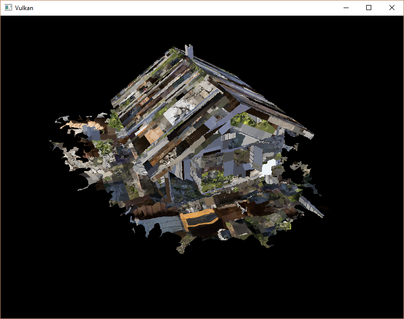

# Vulkan Tutorial 29 Loading models

## Introduction
应用程序现在已经可以渲染纹理3D模型，但是 vertices 顶点和 indices 索引数组中的几何体不是很有趣。
在本章节我们扩展程序，从实际的模型文件冲加载顶点和索引数据，并使图形卡实际做一些工作。

许多图形API系列教程中让读者在这样的章节中编写自己的OBJ加载程序。这样做的问题是任何有趣的3D应用程序很快需要某种功能，
但是该文件格式不支持，比如骨骼动画 skeletal animation。我们将在本章加载 OBJ 模型文件的网格数据，
但是我们更多关注在网格数据与程序本身进行整合，而不是从文件中加载它们的细节。

## Library
我们将使用 tinyobjloader 库来从OBJ文件中加载vertices和faces数据。它很快速，容易集成，因为它是一个单独的文件库，如stb_image。
转到上面链接的库地址，并将 tiny_obj_loader.h 头文件下载到库目录中的文件夹中。

Visual Studio
因为之前已经在VS中设置了引用的库目录在解决方案的根目录下，所以我们直接在库目录新建 tinyobjloader目录 
存放 tiny_obj_loader.h 头文件即可使用.

## Sample mesh
在本章中我们不会涉及光照，所以它有助于使用具有烘培到纹理中的光照的样本模型。
找到这样的模型的简单方法是直接在 Sketchfab 上查找。该网站上的许多模型都具有OBJ格式，并且都有 lisence 授权许可。

在本教程中我们决定使用  Chalet Hippolyte Chassande Baroz 模型，它是由Escadrone制作并授权的。我调整了模型的大小和方向，
将其用作当前几何体的替代品：
* chalet.obj
* chalet.jpg

它有50W个三角形，所以它是我们的应用程序的一个很好的基准。在这里随意使用自己的模型文件，但是要确保它们是由一种材质构成的，
尺寸约为1.5 x 1.5 x 1.5 单位。如果大于此值，则必须修改视图矩阵。将模型文件放在 shaders 和 textures 同级的新模型目录中 models，
并将纹理贴图放在 textures 目录中。

添加两个新的配置变量到程序中，用于定义模型和贴图的路径：

<pre>
const int WIDTH = 800;
const int HEIGHT = 600;

const std::string MODEL_PATH = "models/chalet.obj";
const std::string TEXTURE_PATH = "textures/chalet.jpg";
</pre>

并且更新 createTextureImage 使用该变量：

stbi_uc* pixels = stbi_load(TEXTURE_PATH.c_str(), &texWidth, &texHeight, &texChannels, STBI_rgb_alpha);  

## Loading vertices and indices

现在我们将要从模型文件中加载顶点和索引数据，所以应该移除全局的 vertices 和 indices 数组。将它们作为类成员替换为非常量容器：

std::vector<Vertex> vertices;  
std::vector<uint32_t> indices;  
VkBuffer vertexBuffer;  
VkDeviceMemory vertexBufferMemory;  
在这里应该修改索引数据类型 uint16_t 到 uint32_t 。因为将会有超过65535个或者更多的顶点。还需要更改 vkCmdBindIndexBuffer 参数：

vkCmdBindIndexBuffer(commandBuffers[i], indexBuffer, 0, VK_INDEX_TYPE_UINT32);
tinyobjloader库与STB库一样。包括 tiny_obj_loader.h 文件，并确保在一个源文件中定义 TINYOBJLOADER_IMPLEMENTATION 
以包含函数体，并避免链接错误：

<pre>
#define TINYOBJLOADER_IMPLEMENTATION
#include <tiny_obj_loader.h>
</pre>

我们现在编写一个 loadModel 函数，该函数使用这个库来填充顶点 vertices 和索引 indices 容器，其中包含网格中的顶点数据。
在创建顶点和索引缓冲区之前应该调用它：

<pre>
void initVulkan() {
    ...
    loadModel();
    createVertexBuffer();
    createIndexBuffer();
    ...
}

...

void loadModel() {

}
</pre>

模型加载后被封装到库的数据结构中，通过调用 tinyobj::LoadObj 函数完成。

<pre>
void loadModel() {
    tinyobj::attrib_t attrib;
    std::vector<tinyobj::shape_t> shapes;
    std::vector<tinyobj::material_t> materials;
    std::string err;

    if (!tinyobj::LoadObj(&attrib, &shapes, &materials, &err, MODEL_PATH.c_str())) {
        throw std::runtime_error(err);
    }
}
</pre>

OBJ文件由positions， normals， texture uvs 和 faces组成，其中每个顶点指向一个位置，通过索引指向 法线或者纹理坐标。
这使得不仅可以重复使用整个顶点，还可以具有单独的属性。

attrib 容器持有所有的 positions， normals 和 texture uvs 在它的 attrib.vertices, attrib.normals 
和 attrib.texcoords 容器中。 shapes 容器包含所有单独的对象和面。每个面由一组顶点组成，
每个顶点包含 positions，normals 和 texture uvs 对应的 indices。
OBJ模型也可以定义每个面的材质和纹理，但是我们忽略它们。

err 字符串包含了加载文件过程中产生的错误和警告信息，比如缺少材质的定义。
如果 LoadObj 函数返回 false，则加载才算真的失败。如上所述，OBJ 问及爱你中的面可以包含任意数量的顶点，
而我们的应用程序只能渲染三角形。幸运的是， LoadObj 有一个可选参数来自动对这些面进行三角测量，这是默认启用的。

我们将组合所有的面到一个单独的模型中，所以遍历所有的形状：

<pre>
for (const auto& shape : shapes) {

}
</pre>

三角测量功能已经确保每个面都有三个顶点，所以我们现在可以直接迭代顶点将它们直接存储到我们的 vertices 向量中：
<pre>
for (const auto& shape : shapes) {
    for (const auto& index : shape.mesh.indices) {
        Vertex vertex = {};

        vertices.push_back(vertex);
        indices.push_back(indices.size());
    }
}
</pre>

为了简单起见，我们假设每个顶点现在是唯一的，因此简单的自动递增索引。 index 变量是 tinyobj::index_t 类型的，
包含了 vertex_index, normal_index 和 texcoord_index 成员。我们需要使用这些索引从 attrib 数组中 查找实际的顶点属性：

<pre>
vertex.pos = {
    attrib.vertices[3 * index.vertex_index + 0],
    attrib.vertices[3 * index.vertex_index + 1],
    attrib.vertices[3 * index.vertex_index + 2]
};

vertex.texCoord = {
    attrib.texcoords[2 * index.texcoord_index + 0],
    attrib.texcoords[2 * index.texcoord_index + 1]
};

vertex.color = {1.0f, 1.0f, 1.0f};
</pre>

遗憾的是， attrib.vertices 数组是一个 float 数组，而不是glm::vec3，所以需要将索引乘以 3 。
相似的，每个条目有两个纹理坐标分量。 0，1，2的偏移用于访问X，Y和Z分量，或者在纹理坐标的情况下访问U和V分量。

运行程序，启动优化(例如Visual studio中的 Relase，以及GCC的 -O3 编译器标志)，这是必要的，否则加载模型会很慢，你会看到如下内容：

 

很好，看起来几何图形是正确的，但是纹理贴图发生了什么？这个问题是由于Vulkan的纹理坐标的起点是左上角，而OBJ格式则是左下角。
通过反转纹理坐标的垂直分量来解决这个问题：

<pre>
vertex.texCoord = {
    attrib.texcoords[2 * index.texcoord_index + 0],
    1.0f - attrib.texcoords[2 * index.texcoord_index + 1]
};
</pre>
再次运行程序看到如下正确结果：

 

所有这些艰苦的工作终于开始通过这样的演示得到回报！

## Vertex deduplication
遗憾的是我们并没有真正利用索引缓冲区的优势。 vertices  向量包含大量重复的顶点数据，因为许多顶点包含在多个三角形中。
我们应该只保留唯一的顶点数据，并使用索引缓冲区来重新使用它们。实现这一点的直接方法是使用 map 或者 unordered_map 
来跟踪唯一的顶点和相应的索引信息：

<pre>
#include <unordered_map>

...

std::unordered_map<Vertex, uint32_t> uniqueVertices = {};

for (const auto& shape : shapes) {
    for (const auto& index : shape.mesh.indices) {
        Vertex vertex = {};

        ...

        if (uniqueVertices.count(vertex) == 0) {
            uniqueVertices[vertex] = static_cast<uint32_t>(vertices.size());
            vertices.push_back(vertex);
        }

        indices.push_back(uniqueVertices[vertex]);
    }
}
</pre>

每次从OBJ文件中读取顶点时，我们检查一下是否已经看到一个具有相同位置和纹理坐标的顶点。
如果没有，我们将其添加到 vertices 并将其索引存储在 uniqueVertices 容器中。
之后，我们将新的顶点的索引添加到索引容器中。如果我们已经看到完全相同的顶点，那么我们在 uniqueVertices 中查找其索引，
并将该索引存储在 indices 中。

程序将会编译错误，因为使用类似我们的 Vertex 结构体，它是自定义类型作为哈希表中的键，因为需要实现两个功能：灯饰测试和散列值计算。
前者通过覆盖 Vertex 结构中的 == 运算符很容易实现：

<pre>
bool operator==(const Vertex& other) const {
    return pos == other.pos && color == other.color && texCoord == other.texCoord;
}
</pre>

通过为 std::hash<T> 指定模版专门来实现 Vertex 的哈希函数。散列函数是一个复杂的主题，
但 cppreference.com 建议采用以下方法组合结构体的字段来创建质量比较高的散列函数：

<pre>
namespace std {
    template<> struct hash<Vertex> {
        size_t operator()(Vertex const& vertex) const {
            return ((hash<glm::vec3>()(vertex.pos) ^
                   (hash<glm::vec3>()(vertex.color) << 1)) >> 1) ^ 
                   (hash<glm::vec2>()(vertex.texCoord) << 1);
        }
    };
}
</pre>

该代码应该放置在 Vertex 结构体之外。需要使用以下头文件来包含GLM类型的哈希函数：

<pre>
#include <glm/gtx/hash.hpp>
</pre>

现在应该能够成功编译和运行程序。如果检查 vertices 顶点数量，会发现它已经从 1,500,000 缩小到 265,645！
这意味着每个顶点以平均被 大约6个三角形重新使用。这绝对会为我们节省很多GPU内存。

## Conclusion
到目前为止，已经做了很多工作，但是现在你终于有了一个很好的基础。现在拥有的Vulkan的基本原理的只是应该足以探索更多的更能，诸如：
* Push constants
* Instanced rendering
* Dynamic uniforms
* Separate images and sampler descriptors
* Pipeline cache
* Multi-threaded command buffer generation
* Multi subpasses
* Compute shaders
现在的程序有很多方式进行扩展，比如添加 Blinn-Phong lighting，post-processing效果和阴影映射。
你应该能够了解这些效果如何从其他的API来完成，尽管因为Vulkan的明确性，但是许多概念是相同的。

[代码](src/29.cpp)。

